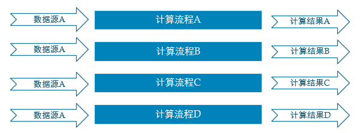
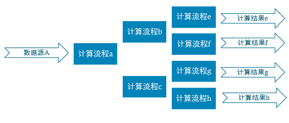

# 普通实时计算与实时数仓比较  
普通的实时计算 **优先考虑时效性**，所以 **从数据源采集经过实时计算直接得到结果**。如此做时效性更好，但是弊端是由于计算过程中的中间结果没有沉淀下来，所以当面对大量实时需求的时候，**计算的复用性较差**，开发成本随着需求增加直线上升。  

  

实时数仓基于一定的数据仓库理念，对数据处理流程进行规划、分层，目的是提高数据的 **复用性**。  

  

# 实时电商数仓，项目分为以下几层
（1）ODS：原始数据，日志和业务数据  

（2）DWD：根据数据对象为单位进行分流，比如订单、页面访问等等  

（3）DIM：维度数据  

（4）DWM：对于部分数据对象进行进一步加工，比如独立访问、跳出行为，也可以和维度进行关联，形成宽表，依旧是明细数据  

（5）DWS：根据某个主题将多个事实数据轻度聚合，形成主题宽表  

（6）ADS：把ClickHouse中的数据根据可视化需进行筛选聚合  