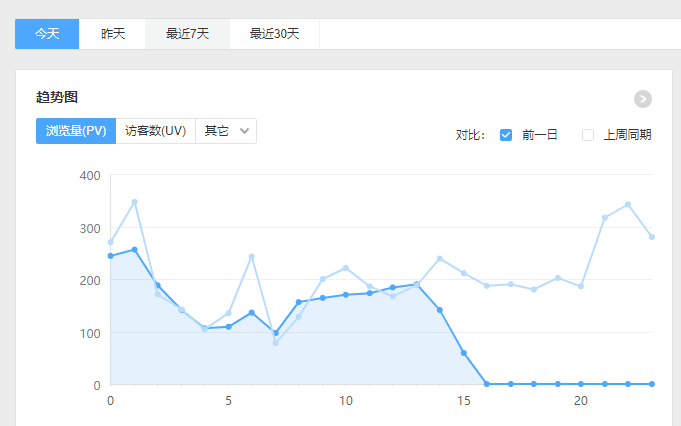
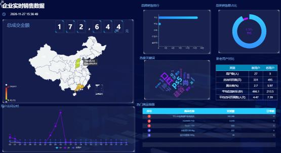

# 1. 离线计算与实时计算的比较  
## 1.1 离线计算  
就是在计算开始前已知所有输入数据，**输入数据不会产生变化，一般计算量级较大**，计算时间也较长。例如今天早上一点，把昨天累积的日志，计算出所需结果。最经典的就是 Hadoop 的 MapReduce 方式；  

一般是根据前一日的数据生成报表，虽然统计指标、报表繁多，但是对时效性不敏感。从技术操作的角度，这部分属于批处理的操作。即根据确定范围的数据一次性计算。  

## 1.2 实时计算  
输入数据是可以以序列化的方式 **一个个输入并进行处理的**，也就是说在开始的时候并不需要知道所有的输入数据。与离线计算相比，**运行时间短，计算量级相对较小**。强调计算过程的时间要短，即所查当下给出结果。  

主要侧重于对当日数据的实时监控，通常业务逻辑相对离线需求简单一些，统计指标也少一些，但是更注重数据的时效性，以及用户的交互性。从技术操作的角度，这部分属于流处理的操作。根据数据源源不断地到达进行实时的运算。  

# 2. 实时需求种类  
## 2.1 日常统计报表或分析图中需要包含当日部分  

  

对于日常企业、网站的运营管理如果仅仅依靠离线计算，数据的时效性往往无法满足。通过实时计算获得当日、分钟级、秒级甚至亚秒的数据更加便于企业对业务进行快速反应与调整。所以实时计算结果往往要与离线数据进行合并或者对比展示在 BI 或者统计平台中。  

## 2.2 实时数据大屏监控  

  

数据大屏，相对于 BI 工具或者数据分析平台是更加直观的数据可视化方式。尤其是一些大促活动，已经成为必备的一种营销手段。  

另外还有一些特殊行业，比如交通、电信的行业，那么大屏监控几乎是必备的监控手段。  

## 2.3 数据预警或提示  
经过大数据实时计算得到的一些风控预警、营销信息提示，能够快速让风控或营销部分得到信息，以便采取各种应对。  

比如，用户在电商、金融平台中正在进行一些非法或欺诈类操作，那么大数据实时计算可以快速的将情况筛选出来发送风控部门进行处理，甚至自动屏蔽。 或者检测到用户的行为对于某些商品具有较强的购买意愿，那么可以把这些 **商机** 推送给客服部门，让客服进行主动的跟进。  

## 2.4 实时推荐系统  
实时推荐就是根据用户的自身属性结合当前的访问行为，经过实时的推荐算法计算，从而将用户可能喜欢的商品、新闻、视频等推送给用户。  

这种系统一般是由一个用户画像批处理加一个用户行为分析的流处理组合而成。