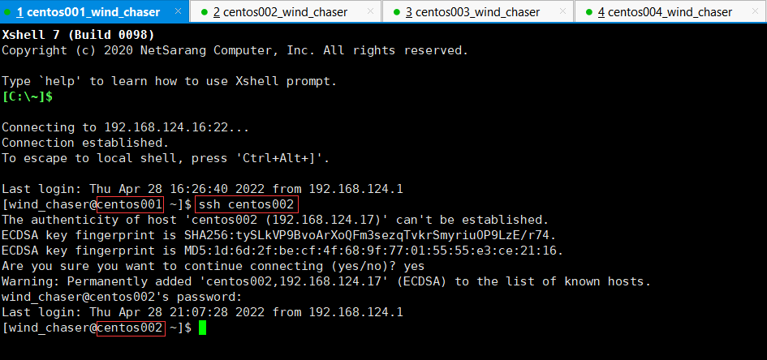
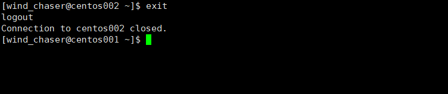
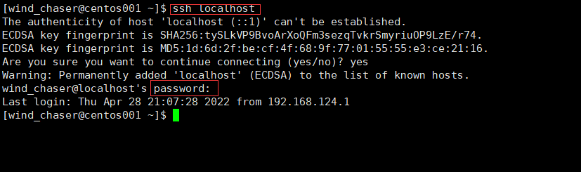
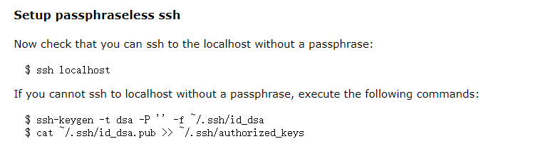
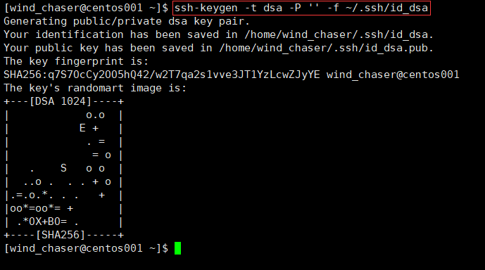
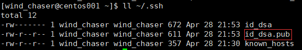
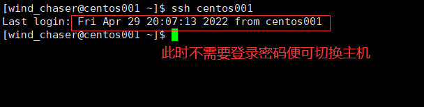
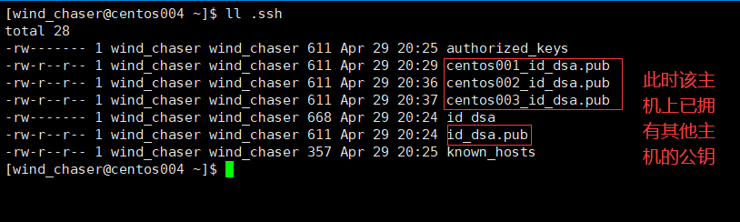
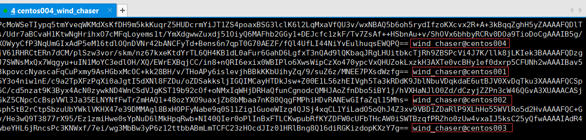

如果不建立免密码通信，节点之间的访问是需要密码的，比如从节点 centos001 ssh 远程登录 centos002 节点。  

使用 ssh 命令进行切换：  
>ssh centos002  

如下图所示：  

  

从上图可以看出，不配置免密通信，切换到对应的主机是需要输入密码的，比较麻烦。  

使用 exit 命令返回之前的主机，如下所示：  

  

如果没有建立免密码通信，即使是主机自己切换到自己，都是需要密码登录的，如下图所示：  

  

接下来参考 [hadoop 的官网](https://hadoop.apache.org/docs/r2.6.5/hadoop-project-dist/hadoop-common/SingleCluster.html) 进行配置，如下图所示：  

  

  
**（1）实现主机自身的免密通信**  
比如在主机 centos001 上，使用如下命令生成公钥文件： 
>ssh-keygen -t dsa -P '' -f ~/.ssh/id_dsa  

  

查看生成的公钥文件：  

  

将公钥文件的内容添加到 authorized_keys 文件中：  
>cat ~/.ssh/id_dsa.pub >> ~/.ssh/authorized_keys  

现在测试主机不使用密码能否自己切换到自己，如下图所示：  

  

并对其他主机进行相同的操作！！！  

如果配置免密登录之后，依然提示需要登录密码的情况，可能是文件权限的问题，需要修改 ~/.ssh/authorized_keys 文件的权限，如下所示：  
>chmod 600 ~/.ssh/authorized_keys  

**（2）实现主机和其他主机之间的免密码通信**  
当实现了主机自己和自己的通信之后，要做的就是实现主机和其他主机之间的通信。  

将刚刚生成的公钥文件分发到其他节点：centos002、centos003 和 centos004，分发的时候，就可以顺便更改文件名，防止和其他的秘钥文件混淆！  

>scp ~/.ssh/id_dsa.pub centos002:\`pwd\`/.ssh/centos001_id_dsa.pub  
>scp ~/.ssh/id_dsa.pub centos003:\`pwd\`/.ssh/centos001_id_dsa.pub  
>scp ~/.ssh/id_dsa.pub centos004:\`pwd\`/.ssh/centos001_id_dsa.pub

当接收到 centos001 主机的公钥文件之后，就可以将其写入到自己的 authorized_keys 文件之中，然后就可以实现 centos001 主机切换到本机免密登录！  

为了减少不必要的操作，我们分别将 centos002 和 centos003 的公钥分发到 centos004 上，然后写入到 centos004 的 authorized_keys 文件中，这样该文件拥有所有主机的公钥，最后将文件分发到其他主机上即可！  

在 centos002 主机上进行如下操作：
>scp ~/.ssh/id_dsa.pub centos004:\`pwd\`/.ssh/centos002_id_dsa.pub

在 centos003 主机上进行如下操作：
>scp ~/.ssh/id_dsa.pub centos004:\`pwd\`/.ssh/centos003_id_dsa.pub

  

此时将其他主机的公钥写入 authorized_keys 文件中，写入的命令为：  
>cat ~/.ssh/centos001_id_dsa.pub >> ~/.ssh/authorized_keys  
>cat ~/.ssh/centos002_id_dsa.pub >> ~/.ssh/authorized_keys  
>cat ~/.ssh/centos003_id_dsa.pub >> ~/.ssh/authorized_keys

此时查看 authorized_keys 文件的内容，如下：  

该文件中已经拥有其他主机的公钥，此时将该文件分发给其他主机：  
>scp ~/.ssh/authorized_keys centos001:\`pwd\`/.ssh/  
>scp ~/.ssh/authorized_keys centos002:\`pwd\`/.ssh/  
>scp ~/.ssh/authorized_keys centos003:\`pwd\`/.ssh/

至此，所有主机之间的免密登录已经配置完成，只不过第一次登录的时候还需要登录密码！