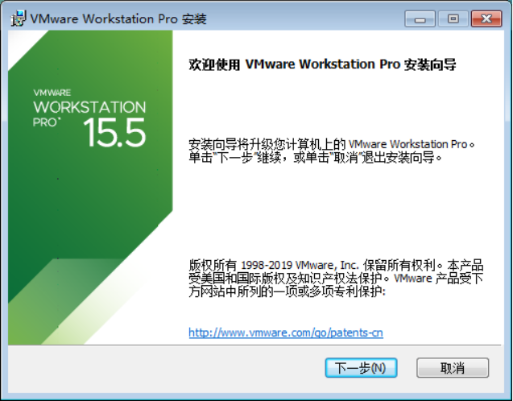
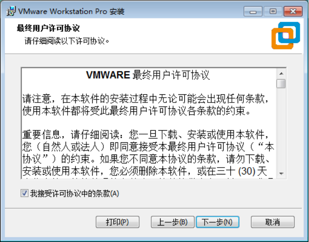
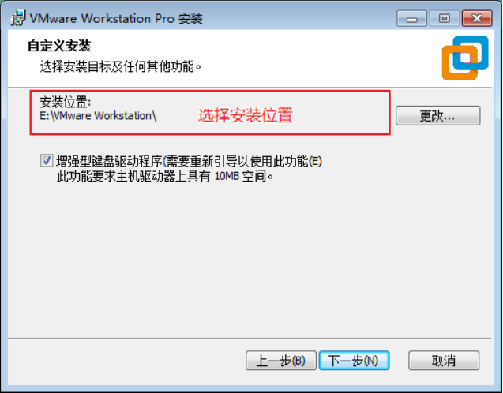
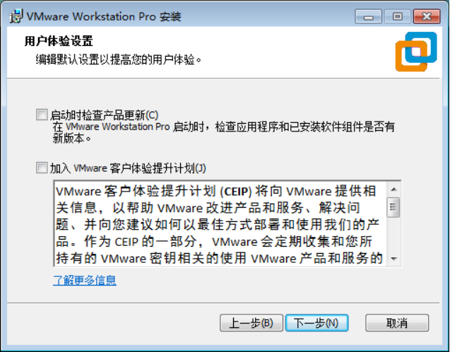
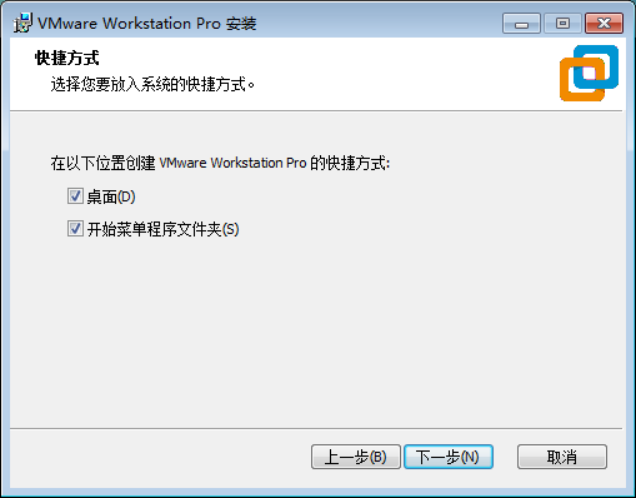
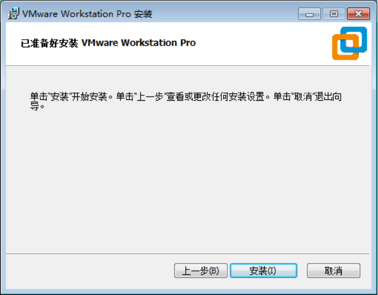
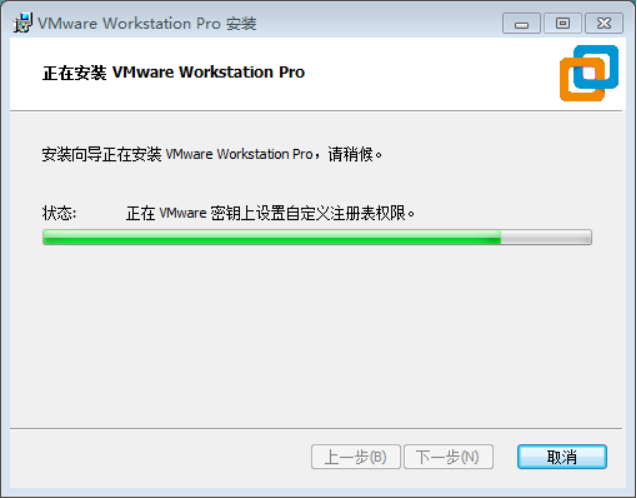

1. 准备 VMware Workstation 的安装包，这里选择的是版本 15

2. 双击安装包，如下所示：  

   

3. 接受许可证协议，如下所示：  

   

4. 选择安装位置，建议非中文无空格，增强型键盘驱动程序可选    

  
 
5. 按照自身使用习惯勾选产品更新和客户体验提升计划  

   

6. 快捷方式  

   

7. 开始安装  

   

8. 等待安装完成  

   

9. 输入许可证即可！！！
