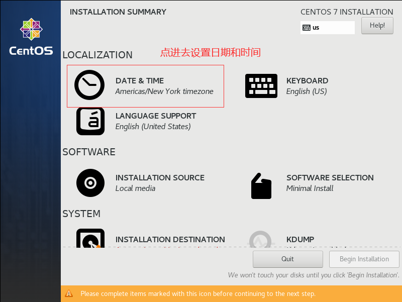

# 一、安装虚拟机  
## 1.1 检查物理机虚拟化支持是否开启  
需要进入到 BIOS 中设置，因各种电脑型号进入 BIOS 方式不同，同学们自行查找对应品牌电脑如何进入 BIOS。  
建议：先安装，如果安装中提示虚拟化未开启，再进入 BIOS 设置，如安装一切顺序，则不需要进行任何设置。如下图所示：  
  

## 1.2 在 VMware 中新建虚拟机  
  

## 1.3 默认即可，不需要做任何修改，直接下一步  
  
  
## 1.4 选择稍后安装操作系统，然后下一步  
  

## 1.5 选择安装的操作系统为 Linux，版本为 CentOS7 64 位  
  

## 1.6 虚拟机命名，可随意取，安装位置最好选择固态硬盘  
  

## 1.7 按照物理机 CPU 实际情况，选择处理器配置  
处理器数量 * 每个处理器内存数量要小于等于物理机 CPU 的数量，否则报错  
查看物理机 CPU 数量，如下图所示：  
  

选择虚拟机 CPU 配置  

## 1.8 选择分配给虚拟机的内存，最少 2G  
  

## 1.9 网络类型选择 NAT  
  

## 1.10 I/O 控制器类型选择默认推荐即可  
  

## 1.11 磁盘类型选择 SCSI  
  

## 1.12 选择创建新虚拟磁盘  
  

## 1.13 指定磁盘容量  
磁盘容量指定 20G(或 50GB)，选择将虚拟磁盘拆分成多个文件。不要勾选立即分配所有磁盘空间，否则会直接占用 20G(或 50GB) 大小的磁盘空间。  
  

## 1.14 选择 Linux 文件的存储位置  
建议选择到 Linux 的安装位置，存储到第 6 步选择的目录下  
  

## 1.15 至此，装机器完成，点击完成即。  
  

# 二、在创建好的虚拟机中正式安装 CentOS 7 系统
***
## 2.1 选择系统盘位置  
  

## 2.2 开启虚拟机  
  

## 2.3 选择 Install CentOS 7  
进入倒计时，鼠标点进去，键盘上下键可以选择，选择 Install CentOS 7，然后回车即可！  
不要选择 Test this media & install CentOS 7。  
TIPS: Ctrl + Alt 可以实现 Windows 主机和 VM 窗口之间的切换。  
  

## 2.4 选择安装语言最好选择英文，公司中用的都是英文  
  

## 2.5 设置日期和时间，选择：亚洲/上海  
  

  

## 2.6 这里不使用桌面系统，因此默认最小化安装  
  

  

## 2.7 设置安装位置，即进行分区  
  

## 2.8 选择我要配置分区，然后点左上角完成进入分区界面  
  

第一个分区，boot 分区，即引导分区，至少 200 m   
  

第二个分区，swap 分区，即交换分区，建议与内存大小一致，设置为 2G  
  

第三个分区，根分区，将剩下的磁盘空间全部分配给根分区  
  

分区设置好之后，接受改变即可  
  

## 2.9 配置网络和主机名  
可选，也可在安装好后进入到系统中配置  
  

  

## 2.10 最后确认配置的各个选项无误，点击开启安装即可  

## 2.11 设置 root 用户的密码  
 

设置密码即可  

## 2.12 最后安装完成重启计算机即可

