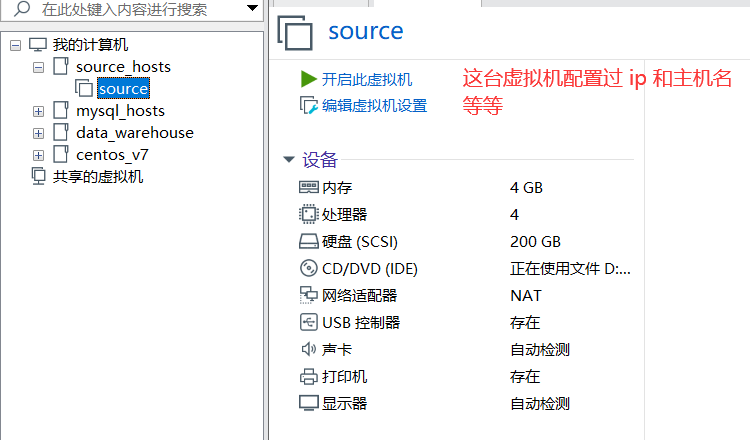
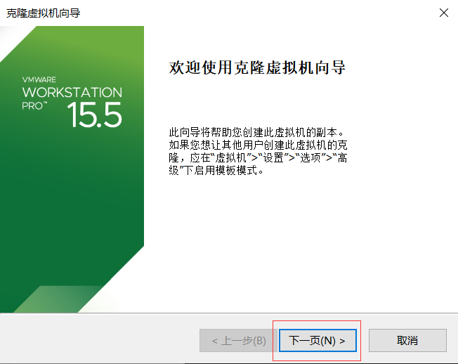
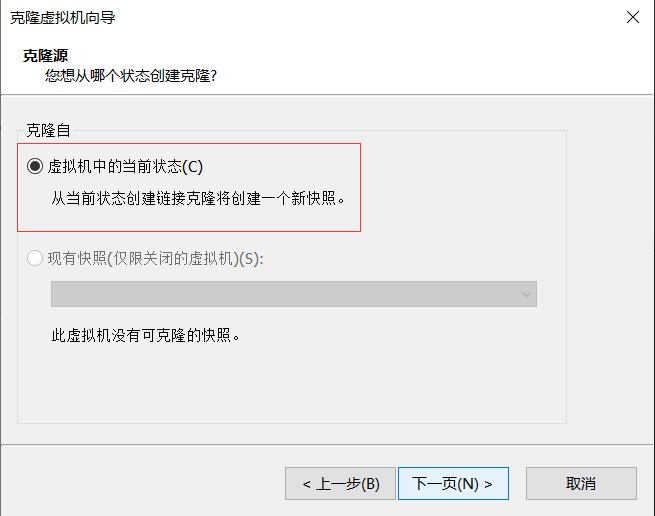
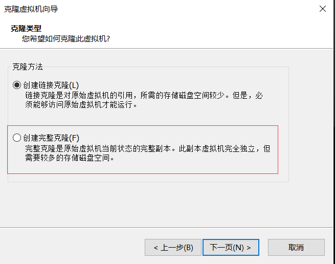
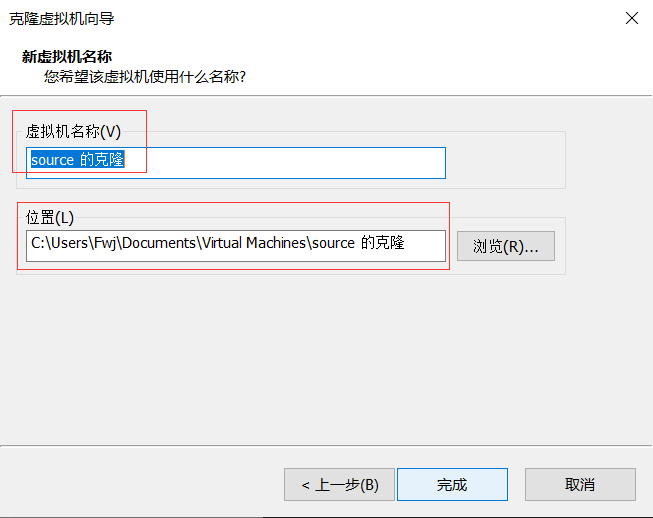
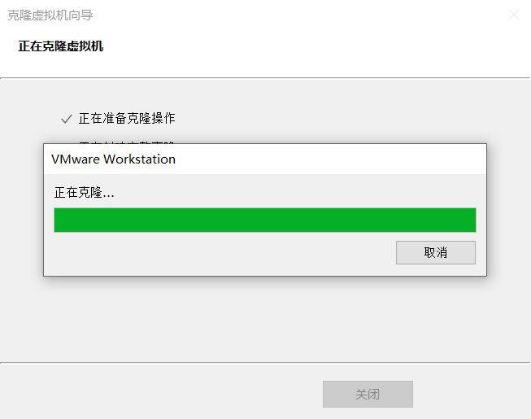
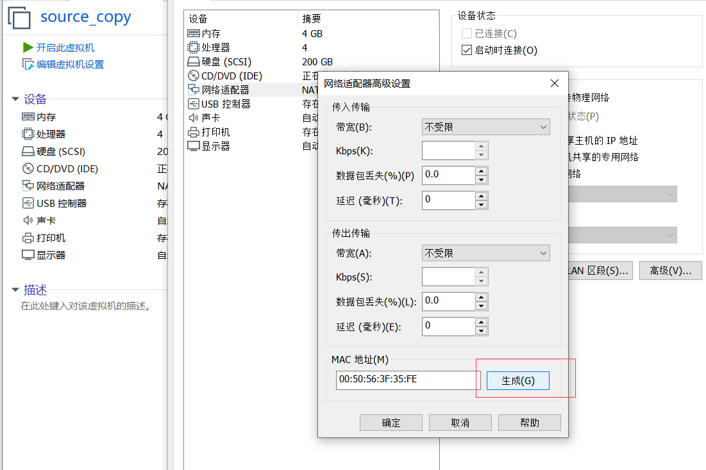

1. 首先准备一台装有 CentOS 7 系统的虚拟机  
注意：虚拟机的克隆需要在关机状态下进行  
  
   

2. 点击要克隆的虚拟机，右键 -> 管理 -> 克隆 -> 下一页  
  
   

3. 从当前状态或者某一个快照处克隆即可  
  
   

4. 选择完整克隆，创建的是一台完全独立的虚拟机  
  
   

5. 设置虚拟机的名称和位置即可  
  
   

6. 等待克隆完成即可！  
  
   

7. 开机前修改 mac 地址  
点击编辑虚拟机设置，选择网络适配器，点击右下角高级然后下边就是 mac 地址，这个 mac 地址和被克隆的是一样的，我们点击生成，重新生成一个新的 mac 地址：  
  
   

8. 开机后修改主机名称  
修改主机名可能不同 linux 版本不同，修改方法也不同。centos 7 就是 vim/etc/hostname 命令来编辑主机名。修改之后，需要重启 reboot。  
  

9. 修改 IP 地址  
注意：如果虚拟机使用的是动态 ip 分配，那么不需要更改 ip，如果想改为静态 ip，请修改：  
vim /etc/sysconfig/network-scripts/ifcfg-ens33  
   

10. 修改 UUID  
同样在修改 ip 地址的路径中修改即可  
    

11. 最后需要重启网络服务  
systemctl restart network

