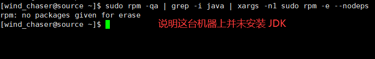
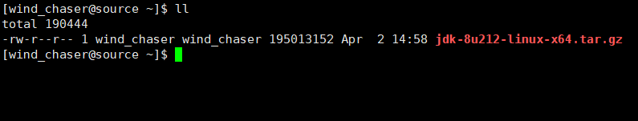
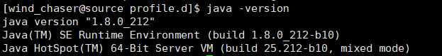

1.卸载现有 JDK  
>sudo rpm -qa | grep -i java | xargs -n1 sudo rpm -e --nodeps  

    

2.将 JDK 的安装包上传到 Linux 服务器的 soft_packages 文件夹下  
这个目录可以自己创建，如下所示：  

  

3.解压 JDK 到 /opt/module 目录下  
>tar -zxvf jdk-8u212-linux-x64.tar.gz -C /opt/module/  

4.配置 JDK 环境变量  

（1）新建 /etc/profile.d/my_env.sh 文件  
>sudo vim /etc/profile.d/my_env.sh  

并添加一下内容：  
>\# JAVA_HOME  
export JAVA_HOME=/opt/module/jdk1.8.0_212  
export PATH=$PATH:$JAVA_HOME/bin  

（2）让环境变量生效  
>source /etc/profile  

5.测试 JDK 是否安装成功  
>java -version  

  

