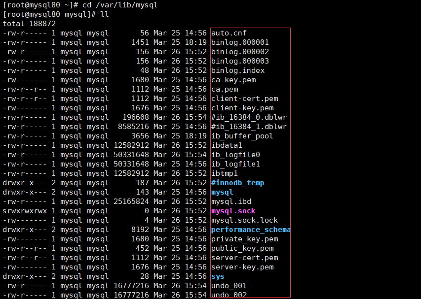
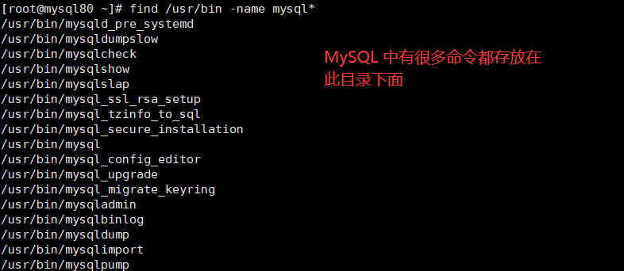

# 1. MySQL 8 的主要目录结构  
>[root@mysql80 ~]# find / -name mysql  

  

安装好 MySQL 8 之后，我们查看如下的目录结构：  

## 1.1 数据库文件的存放路径  
MySQL 服务器程序在启动时会到文件系统的某个目录下加载一些文件，之后在运行过程中产生的数据也都会存储到这个目录下的某些文件中，这个目录就称为 **数据目录**。  

MysQL 把数据都存到哪个路径下呢？其实数据目录对应着一个系统变量 datadir，我们在使用客户端与服务器建立连接之后查看这个系统变量的值就可以了：  

MySQL 数据库文件的存放路径：/var/lib/mysql/  

切换到该路径下进行查看：  
  

从上图中可以看出，sys、performance_schema 以及 mysql 等等，都是已经存在的数据库。  

## 1.2 相关命令存放的目录  
对于一个 Linux 程序而言，一般其命令文件都存放在 bin 和 sbin 目录下。而 MySQL 相关命令所在的目录为 /usr/bin（mysqladmin、mysqlbinlog、mysqldump等命令）和 /usr/sbin。  

  

  

## 1.3 配置文件目录  
配置文件目录：/usr/share/mysql-8.0（命令及配置文件），/etc/mysql（如my.cnf）  

  

# 2. 数据库和文件系统的关系
像 InnoDB、MyISAM 这样的存储引擎都是把表存储在磁盘上的，操作系统用来管理磁盘的结构被称为文件系统，所以用专业一点的话来表述就是：像 InnoDB、MyISAM 这样的存储引擎都是把表存储在文件系统上的。当我们想读取数据的时候，这些存储引擎会从文件系统中把数据读出来返回给我们，当我们想写入数据的时候，这些存储引擎会把这些数据又写回文件系统。本章学习一下 InnoDB 和 MyISAM 这两个存储引擎的数据如何在文件系统中存储。  

## 2.1 查看默认数据库  
查看一下在我的计算机上当前有哪些数据库：  
>mysql> show databases;  

  

可以看到有 4 个数据库是属于 MySQL 自带的系统数据库。  

mysql：  
MySQL 系统自带的核心数据库，它存储了 MySQL 的用户账户和权限信息，一些存储过程、事件的定义信息，一些运行过程中产生的日志信息，一些帮助信息以及时区信息等。  

information_schema：  
MySQL 系统自带的数据库，这个数据库保存着 MySQL 服务器维护的 **所有其他数据库的信息**，比如有哪些表、哪些视图、哪些触发器、哪些列、哪些索引。这些信息并不是真实的用户数据，而是一些描述性信息，有时候也称之为 **元数据**。在系统数据库 information_schema 中提供了一些以 innodb_sys 开头的表，用于表示内部系统表。  

performance_schema：  
MySQL 系统自带的数据库，这个数据库里主要保存 MySQL 服务器运行过程中的一些状态信息，可以用来监控 MySQL 服务的各类性能指标 。包括统计最近执行了哪些语句，在执行过程的每个阶段都花费了多长时间，内存的使用情况等信息。  

sys：  
MySQL 系统自带的数据库，这个数据库主要是通过 **视图** 的形式把 information_schema 和 performance_schema 结合起来，帮助系统管理员和开发人员监控 MySQL 的技术性能。  

## 2.2 数据库在文件系统中的表示  
使用 CREATE DATABASE 数据库名语句创建一个数据库的时候，在文件系统上实际发生了什么呢？其实很简单，每个数据库都对应数据目录下的一个子目录，或者说对应一个文件夹，每当新建一个数据库时，MySQL 会帮我们做这两件事儿：  

* 1.在数据目录下创建一个和数据库名同名的子目录。  
* 2.在与该数据库名同名的子目录下创建一个名为 db.opt 的文件（仅限 MySQL 5.7 及之前版本），这个文件中包含了该数据库的各种属性，比如该数据库的字符集和比较规则。  

## 2.3 表在文件系统中的表示  
### 2.3.1 InnoDB 存储引擎模式  
1. 表结构：   
为了保存表结构，InnoDB 在 数据目录 下对应的数据库子目录下创建了一个专门用于 描述表结构的文件 ，文件名是这样：

