# 1. 安装前说明  
## 1.1 Linux 系统及工具的准备  
* 安装并启动好两台虚拟机：CentOS 7 系统  
> [1.安装一台原始的 Linux 系统](https://github.com/WindChaser0821/ComputerInterview/blob/master/Linux/002_VMware%20Workstation%20%E4%B8%8A%20Centos%207%20%E7%B3%BB%E7%BB%9F%E7%9A%84%E5%AE%89%E8%A3%85.md)  
> [2.克隆多台虚拟机，并修改配置](https://github.com/WindChaser0821/ComputerInterview/blob/master/Linux/003_Linux%20%E8%99%9A%E6%8B%9F%E6%9C%BA%E7%9A%84%E5%85%8B%E9%9A%86.md)
  
* 安装有 Xshell 和 Xftp 等访问 CentOS 系统的工具
* CentOS 6 和 CentOS 7 在 MySQL 的使用中的区别
> 1.防火墙：6 是 iptables，7 是 firewalld  
> 2.启动服务的命令：6 是 service，7 是 systemctl  

## 1.2 查看是否安装过 MySQL  
* 如果你是用 rpm 安装, 检查一下 RPM PACKAGE：  
>rpm -qa | grep -i mysql  # -i 忽略大小写

* 检查 mysql service：  
>systemctl status mysqld.service
  
* 如果存在 mysql-libs 的旧版本包，显示如下：  
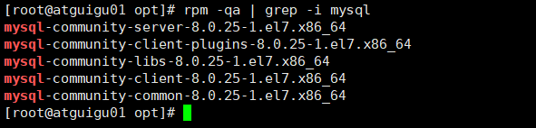  
  

* 如果不存在 mysql-lib 的版本，显示如下：  
  
  

## 1.3 MySQL 的卸载  
### 1.3.1 关闭 mysql 服务  
>systemctl stop mysqld.service  

### 1.3.2 查看当前 mysql 安装状况  
>rpm -qa | grep -i mysql 或 yum list installed | grep mysql  

### 1.3.3 卸载上述命令查询出的已安装程序  
>yum remove mysql-xxx mysql-xxx mysql-xxx mysqk-xxxx  

### 1.3.4 删除 mysql 相关文件  
* 查找相关文件  
>find / -name mysql  

* 删除上述命令查找出的相关文件  
>rm -rf xxx  

### 1.3.5 删除 my.cnf  
>rm -rf /etc/my.cnf  

# 2. MySQL 的 Linux 版安装  
## 2.1 MySQL 的 4 大版本  
* **MySQL Community Server 社区版本**：开源免费，自由下载，但不提供官方技术支持，适用于
大多数普通用户。  

* **MySQL Enterprise Edition 企业版本**：需付费，不能在线下载，可以试用 30 天。提供了更多的
功能和更完备的技术支持，更适合于对数据库的功能和可靠性要求较高的企业客户。  

* **MySQL Cluster 集群版**：开源免费。用于架设集群服务器，可将几个 MySQL Server 封装成一个
Server。需要在社区版或企业版的基础上使用。  

* **MySQL Cluster CGE 高级集群版**：需付费。  

## 2.2 下载 MySQL 指定版本  
### 2.2.1 下载地址
官网：https://www.mysql.com  

### 2.2.2 打开官网，点击 DOWNLOADS  
然后，点击 MySQL Community(GPL) Downloads  
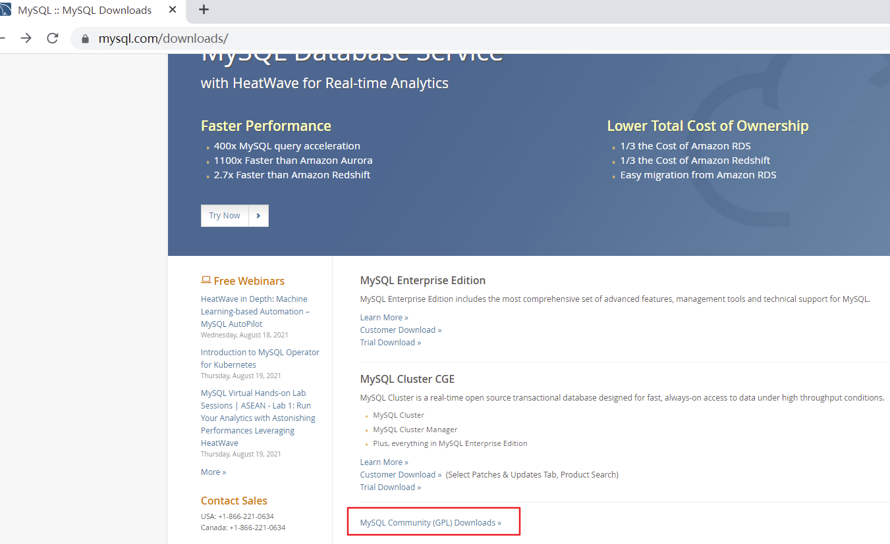  

### 2.2.3 点击 MySQL Community Server  
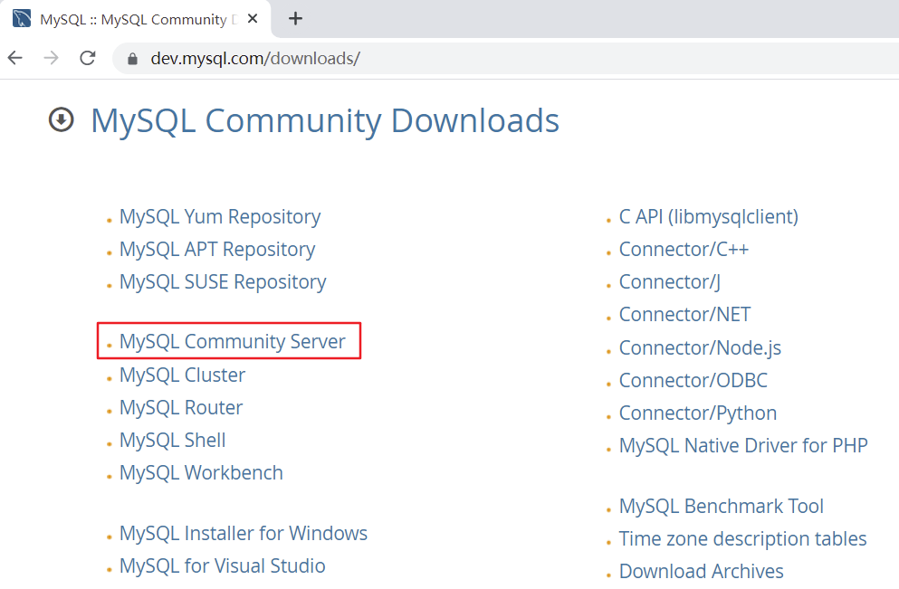  

### 2.2.4 在 General Availability(GA) Releases 中选择适合的版本  
* 如果安装 Windows 系统下 MySQL ，推荐下载 MSI 安装程序 ；点击 Go to Download Page 进行下载即可  

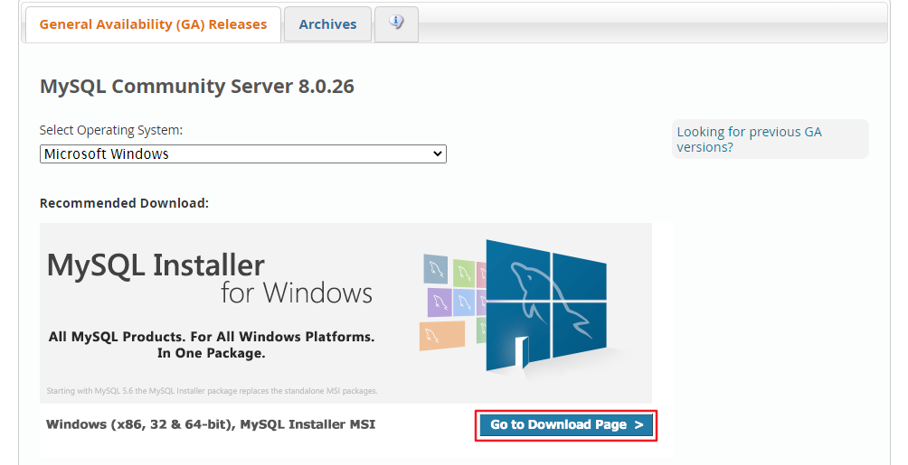  

## 2.3 Linux 系统下安装 MySQL 的几种方式  
### 2.3.1 Linux 系统下安装软件的常用三种方式  
方式 1：rpm 命令  
使用 rpm 命令安装扩展名为 ".rpm" 的软件包, .rpm 包的一般格式：  
  

方式 2：yum 命令  
需联网，从互联网获取的 yum 源，直接使用 yum 命令安装。  

方式 3：编译安装源码包  
针对 tar.gz 这样的压缩格式，要用 tar 命令来解压；如果是其它压缩格式，就使用其它命令。  

### 2.3.2 Linux 系统下安装 MySQL，官方给出多种安装方式  
| 安装方式 | 特点 |
| :------ | :------ | 
| rpm | 安装简单，灵活性差，无法灵活选择版本、升级 | 
| rpm repository | 安装包极小，版本安装简单灵活，升级方便，需要联网安装 |
| 通用二进制包 | 安装比较复杂，灵活性高，平台通用性好 |
| 源码包 | 安装最复杂，时间长，参数设置灵活，性能好 |

* 这里不能直接选择 CentOS 7 系统的版本，所以选择与之对应的 Red Hat Enterprise Linux  
* https://downloads.mysql.com/archives/community/ 直接点 Download 下载 RPM Bundle 全量
  包。包括了所有下面的组件。不需要一个一个下载了。  
  
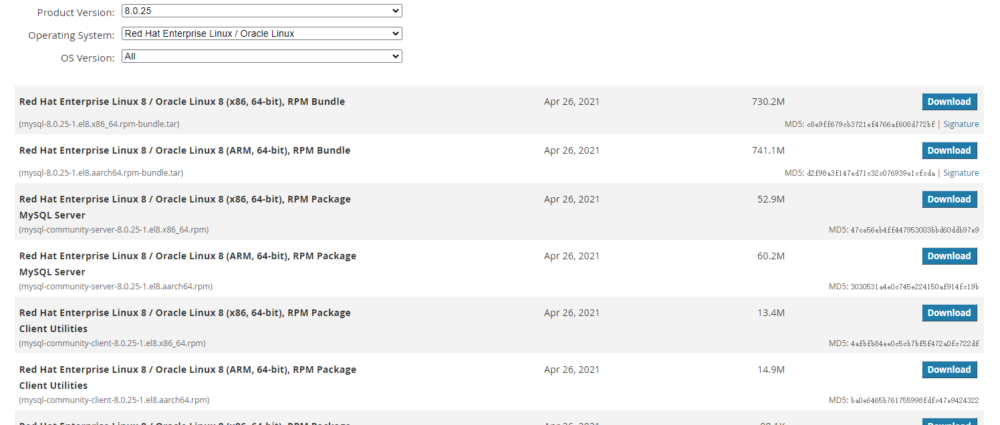  

## 2.4 将下载好的 tar 包，用压缩工具打开  
  

解压后 rpm 安装包 （红框为抽取出来的安装包）  
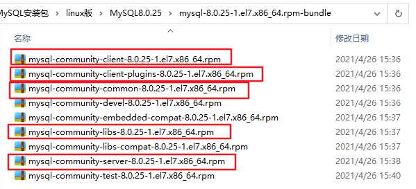  

## 2.5 CentOS 7 下检查 MySQL 依赖  
### 2.5.1 检查 /tmp 临时目录权限（必不可少）  
由于 mysql 安装过程中，会通过 mysql 用户在 /tmp 目录下新建 tmp_db 文件，所以请给 /tmp 较大的权限。执行：  
>chmod -R 777 /tmp  

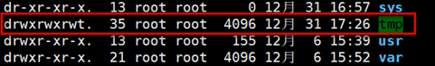  
### 2.5.2 安装前，检查依赖  
>rpm -qa | grep libaio  

如果存在 libaio 包如下：  
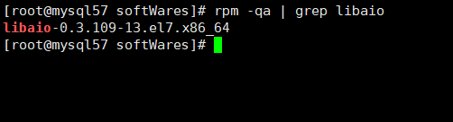  

>rpm -qa | grep net-tools  

如果存在 net-tools 包如下：  
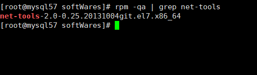  

注意：如果不存在，需要到 centos 安装盘里进行 rpm 安装，或者使用 yum 的方式安装

## 2.6 CentOS7 下 MySQL 安装过程  
### 2.6.1 将安装程序拷贝到指定目录下，可以自己创建  
在 mysql 的安装文件目录下执行以下命令：（必须按照顺序执行）  
>rpm -ivh mysql-community-common-8.0.25-1.el7.x86_64.rpm  
> 
>rpm -ivh mysql-community-client-plugins-8.0.25-1.el7.x86_64.rpm  
> 
>rpm -ivh mysql-community-libs-8.0.25-1.el7.x86_64.rpm  
> 
>rpm -ivh mysql-community-client-8.0.25-1.el7.x86_64.rpm  
> 
>rpm -ivh mysql-community-server-8.0.25-1.el7.x86_64.rpm

注意：如在检查工作时，没有检查 mysql 依赖环境在安装 mysql-community-server 会报错  
* rpm 是 Redhat Package Manage 缩写，通过 RPM 的管理，用户可以把源代码包装成以 rpm 为扩展名的
文件形式，易于安装。  
* -i , --install 安装软件包  
* -v , --verbose 提供更多的详细信息输出  
* -h , --hash 软件包安装的时候列出哈希标记 (和 -v 一起使用效果更好)，展示进度条  

安装过程中可能的报错信息：  
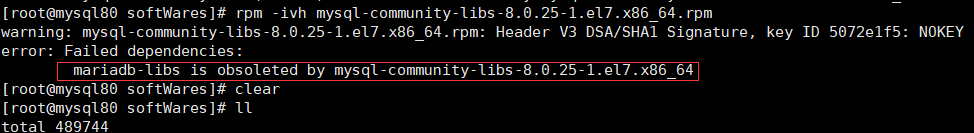

一个命令：yum remove mysql-libs 解决，清除之前安装过的依赖即可  

### 2.6.2 查看 MySQL 版本  
执行如下命令，如果成功表示安装 mysql 成功。类似 java -version 如果打出版本等信息  
>mysql --version 或 mysqladmin --version  

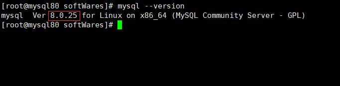  

执行如下命令，查看是否安装成功。需要增加 -i 不用去区分大小写，否则搜索不到  
>rpm -qa | grep -i mysql  

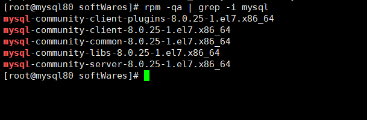  

### 2.6.3 服务的初始化  
为了保证数据库目录与文件的所有者为 mysql 登录用户，如果你是以 root 身份运行 mysql 服务，需要执行下面的命令初始化：  
>mysqld --initialize --user=mysql  

说明：--initialize 选项默认以 “安全” 模式来初始化，则会为 root 用户生成一个密码并将 `该密码标记为过期`，登录后你需要设置一个新的密码。生成的 `临时密码` 会往日志中记录一份。  

查看密码：  
>cat /var/log/mysqld.log  

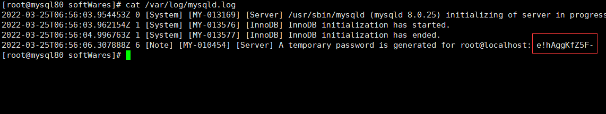  

root@localhost：后面就是初始化的密码  

### 2.6.4 启动 MySQL，查看状态  
加不加 .service 后缀都可以  
>启动：systemctl start mysqld.service  
关闭：systemctl stop mysqld.service  
重启：systemctl restart mysqld.service  
查看状态：systemctl status mysqld.service  

mysqld 这个可执行文件就代表着 MySQL 服务器程序，运行这个可执行文件就可以直接启动一个服务器进程。  

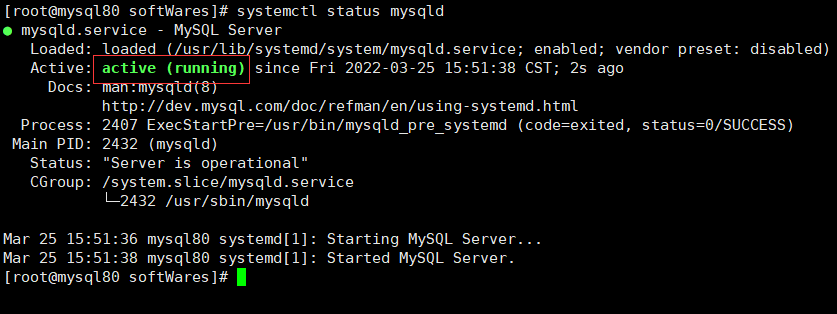  

查看进程：
>ps -ef | grep mysql  

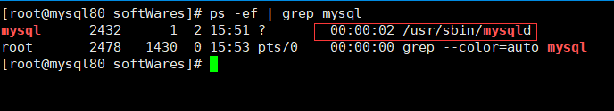  

### 2.6.5 查看 MySQL 服务是否自启动  
>systemctl list-unit-files|grep mysqld.service  

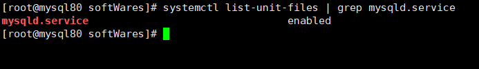  

默认是 enabled。  

* 如不是 enabled 可以运行如下命令设置自启动
>systemctl enable mysqld.service  

* 如果希望不进行自启动，运行如下命令设置  
>systemctl disable mysqld.service  

# 3. MySQL 登录  
## 3.1 首次登录  
通过  mysql -hlocalhost -P3306 -uroot -p 进行登录，再 Enter password：录入初始化密码  
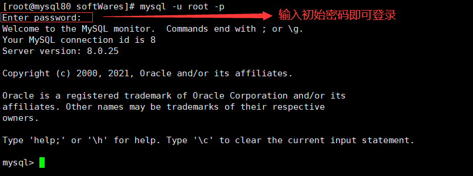  

## 3.2 修改密码  
* 因为初始化密码默认是过期的，所以查看数据库会报错  
* 修改密码：  
>alter user 'root'@'localhost' identified by 'new_password';  

## 3.3 设置远程登录  
### 3.3.1 当前问题  
在用 SQLyog 或 Navicat 中配置远程连接 Mysql 数据库时遇到如下报错信息，这是由于 Mysql 配置了不支持远程连接引起的。  

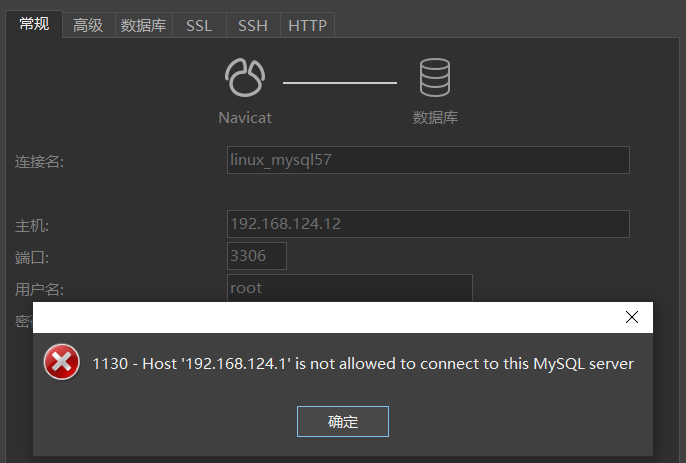  

### 3.3.2 确认网络  
1.在远程机器上使用 ping ip 地址 保证网络畅通  
2.在远程机器上使用 telnet 命令 保证端口号开放访问  

>telnet ip地址 端口号  

拓展：`telnet 命令开启`  
  

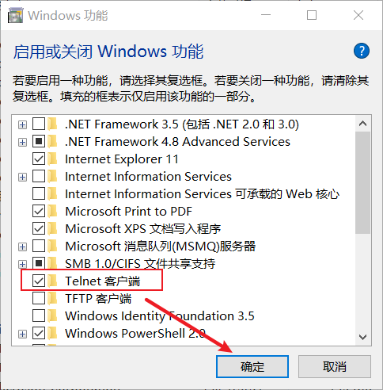  

### 3.3.3 关闭防火墙或开放端口  
方式一：关闭防火墙  
CentOS 6：
>service iptables stop  

CentOS7：  
>systemctl start firewalld.service  
>systemctl status firewalld.service  
>systemctl stop firewalld.service  
> 
>设置开机启用防火墙  
>systemctl enable firewalld.service  
> 
>设置开机禁用防火墙  
>systemctl disable firewalld.service

方式二：开放端口  
查看开放的端口号：  
>firewall-cmd --list-all  

设置开放的端口号：  
>firewall-cmd --add-service=http --permanent  
>firewall-cmd --add-port=3306/tcp --permanent

重启防火墙：  
>firewall-cmd --reload  

### 3.3.4 Linux 下修改配置  
在 Linux 系统 MySQL 下测试：  
>use mysql;  
select Host, User from user;  

  

可以看到 root 用户的当前主机配置信息为 localhost。

>Host 列指定了允许用户登录所使用的 IP，比如 user=root Host=192.168.1.1。这里的意思就是说 root 用户只
能通过 192.168.1.1 的客户端去访问。 user=root Host=localhost，表示只能通过本机客户端去访问。而 %
是个通配符，如果 Host=192.168.1.%，那么就表示只要是 IP 地址前缀为 “192.168.1.” 的客户端都可以连
接。如果 Host=% ，表示所有 IP 都有连接权限。  

注意：在生产环境下不能为了省事将 host 设置为 %，这样做会存在安全问题，具体的设置可以根据生产
环境的 IP 进行设置。  

>update user set host = '%' where user ='root';  

Host 设置了 “%” 后便可以允许远程访问。  
  

Host 修改完成后记得执行 flush privileges 使配置立即生效：  
>flush privileges;  

# 4. 字符集相关操作  
在 MySQL 8.0 版本之前，默认字符集为 latin1 ，utf8 字符集指向的是 utf8mb3 。网站开发人员在数据库设计的时候往往会将编码修改为 utf8 字符集。如果遗忘修改默认的编码，就会出现乱码的问题。从 MySQL
8.0 开始，数据库的默认编码将改为 utf8mb4 ，从而避免上述乱码的问题。  

## 4.1 修改 MySQL5.7 字符集  
### 4.1.1 修改步骤  
操作 1：查看默认使用的字符集  
>show variables like 'character%'; 或 show variables like '%char%';  

MySQL 5.7 中执行：  
MySQL 5.7 默认的客户端和服务器都用了 latin1 ，不支持中文，保存中文会报错。MySQL 5.7 截图如下：  
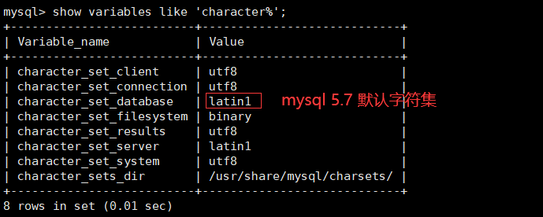  

MySQL 8.0 中执行：  
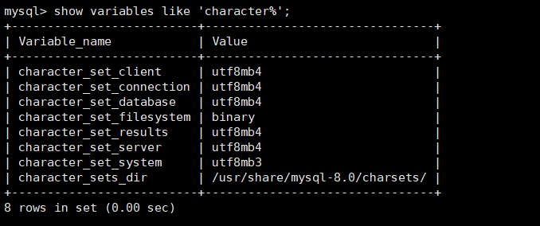  

操作 2：修改字符集  
>vim /etc/my.cnf  

在 MySQL 5.7 或之前的版本中，在文件最后加上中文字符集配置：  
>character_set_server=utf8  

  

操作 3：重新启动 MySQL 服务  
>systemctl restart mysqld  

注意：原库、原表的设定不会发生变化，参数修改只对新建的数据库生效  

### 4.1.2 已有库 & 表字符集的变更  
MySQL 5.7 版本中，以前创建的库，创建的表字符集还是 latin1。 

修改已创建数据库的字符集：  
>alter database 数据库名 character set 'utf8';  

修改已创建数据表的字符集：  
>alter table 表名 convert to character set 'utf8';  

## 4.2 各级别的字符集  
MySQL 有 4 个级别的字符集和比较规则，分别是：  
>（1）服务器级别；（2）数据库级别；（3）表级别；（4）列级别  

执行如下 SQL 语句：  
>show variables like 'character%';  

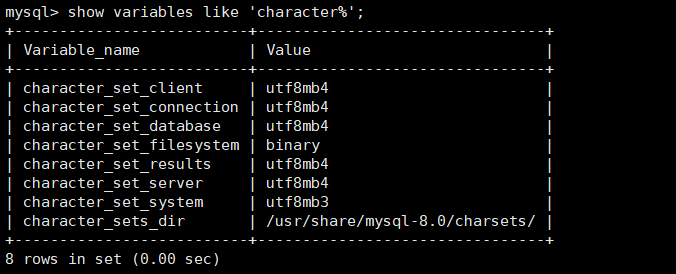  

### 4.2.1 服务器级别  
character_set_server：服务器级别的字符集  
我们可以在启动服务器程序时通过启动选项或者在服务器程序运行过程中使用 SET 语句修改这两个变量
的值。比如我们可以在配置文件中这样写：  

>[server]  
character_set_server=gbk  # 默认字符集  
collation_server=gbk_chinese_ci  # 对应的默认的比较规则  

当服务器启动的时候读取这个配置文件后这两个系统变量的值便修改了。  

### 4.2.2 数据库级别  
character_set_database：当前数据库的字符集  
我们在创建和修改数据库的时候可以指定该数据库的字符集和比较规则，具体语法如下：  
>CREATE DATABASE 数据库名  
[[DEFAULT] CHARACTER SET 字符集名称]  
[[DEFAULT] COLLATE 比较规则名称];  
> 
>ALTER DATABASE 数据库名  
[[DEFAULT] CHARACTER SET 字符集名称]  
[[DEFAULT] COLLATE 比较规则名称];  

### 4.2.3 表级别  
我们也可以在创建和修改表的时候指定表的字符集和比较规则，语法如下：  

>CREATE TABLE 表名 (列的信息)  
[[DEFAULT] CHARACTER SET 字符集名称]  
[COLLATE 比较规则名称]]  
> 
>ALTER TABLE 表名  
[[DEFAULT] CHARACTER SET 字符集名称]  
[COLLATE 比较规则名称]  

如果创建和修改表的语句中没有指明字符集和比较规则，将使用该表所在数据库的字符集和比较规则作为该表的字符集和比较规则。  

### 4.2.4 列级别  
对于存储字符串的列，同一个表中的不同的列也可以有不同的字符集和比较规则。我们在创建和修改列定义的时候可以指定该列的字符集和比较规则，语法如下：  

>CREATE TABLE 表名(  
列名 字符串类型 [CHARACTER SET 字符集名称] [COLLATE 比较规则名称],  
其他列...  
);  
> 
>ALTER TABLE 表名 MODIFY 列名 字符串类型 [CHARACTER SET 字符集名称] [COLLATE 比较规则名称];  

对于某个列来说，如果在创建和修改的语句中没有指明字符集和比较规则，将使用该列所在表的字符集和比较规则作为该列的字符集和比较规则。  

提示：在转换列的字符集时需要注意，如果转换前列中存储的数据不能用转换后的字符集进行表示会发生错误。比方说原先列使用的字符集是 utf8，列中存储了一些汉字，现在把列的字符集转换为 ascii 的话就会出错，因为 ascii 字符集并不能表示汉字字符。  

### 4.2.5 小结  
我们介绍的这4个级别字符集和比较规则的联系如下：  
* 如果 **创建或修改列** 时没有显式的指定字符集和比较规则，则该列 **默认用表的** 字符集和比较规则  
* 如果 **创建表时** 没有显式的指定字符集和比较规则，则该表 **默认用数据库的** 字符集和比较规则  
* 如果 **创建数据库时** 没有显式的指定字符集和比较规则，则该数据库 **默认用服务器的** 字符集和比较规则  

知道了这些规则之后，对于给定的表，我们应该知道它的各个列的字符集和比较规则是什么，从而根据这个列的类型来确定存储数据时每个列的实际数据占用的存储空间大小了。比方说我们向表 t 中插入一条记录：  

>mysql> INSERT INTO t(col) VALUES('我们');  
Query OK, 1 row affected (0.00 sec)  
> 
>mysql> SELECT * FROM t;  
+--------+  
| s   |  
+--------+  
| 我们  |  
+--------+  
1 row in set (0.00 sec)  

## 4.3 字符集与比较规则（了解）    
### 4.3.1 utf8 与 utf8mb4  
utf8 字符集表示一个字符需要使用 1～4 个字节，但是我们常用的一些字符使用 1～3 个字节就可以表示了。而字符集表示一个字符所用的最大字节长度，在某些方面会影响系统的存储和性能，所以设计 MySQL 的设计者偷偷的定义了两个概念：
* utf8mb3：阉割过的 utf8 字符集，只使用 1～3 个字节表示字符。  
* utf8mb4：正宗的 utf8 字符集，使用 1～4 个字节表示字符。  

### 4.3.2 比较规则  
上表中，MySQL 版本一共支持 41 种字符集，其中的 Default collation 列表示这种字符集中一种默认的比较规则，里面包含着该比较规则主要作用于哪种语言，比如 utf8_polish_ci 表示以波兰语的规则比较， utf8_spanish_ci 是以西班牙语的规则比较， utf8_general_ci 是一种通用的比较规则。  

使用命令查看字符集
>show charset;  

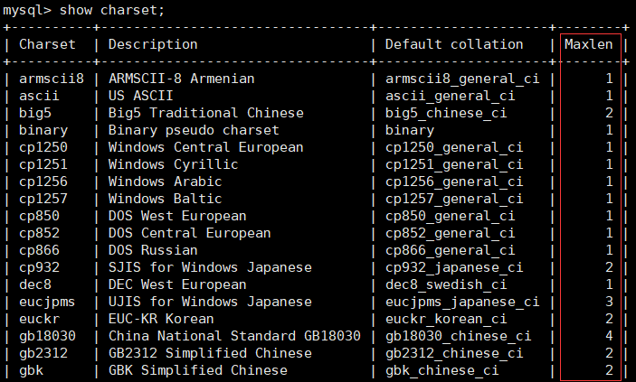  

后缀表示该比较规则是否区分语言中的重音、大小写。具体如下：

| 后缀 | 英文释义 | 描述 |
| :------| :------ | :------ |
| _ai | accent insensitive | 不区分重音 |
| _as | accent sensitive | 区分重音 |
| _ci | case insensitive | 不区分大小写 |
| _cs | case sensitive | 区分大小写 |
| _bin | binary | 以二进制方式比较 |

最后一列 Maxlen ，它代表该种字符集表示一个字符最多需要几个字节。 

常用操作 1：  
>查看 GBK 字符集的比较规则  
SHOW COLLATION LIKE 'gbk%';  

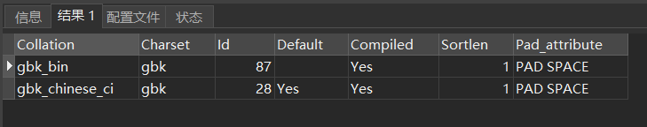  

>查看 UTF-8 字符集的比较规则
SHOW COLLATION LIKE 'utf8%';  

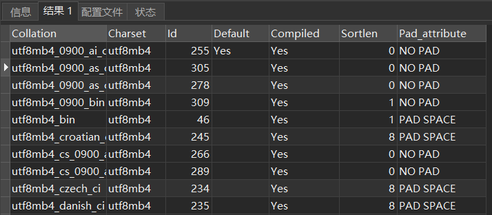  

常用操作 2：  
>查看服务器的字符集和比较规则  
SHOW VARIABLES LIKE '%_server';  
> 
>查看数据库的字符集和比较规则  
SHOW VARIABLES LIKE '%_database';
> 
>查看具体数据库的字符集  
SHOW CREATE DATABASE dbtest1;  
> 
>修改具体数据库的字符集  
ALTER DATABASE dbtest1 DEFAULT CHARACTER SET 'utf8' COLLATE 'utf8_general_ci';  

常用操作 3：  
>查看表的字符集  
>show create table employees;  
> 
>查看表的比较规则  
show table status from atguigudb like 'employees';  
> 
>修改表的字符集和比较规则  
ALTER TABLE emp1 DEFAULT CHARACTER SET 'utf8' COLLATE 'utf8_general_ci';  

