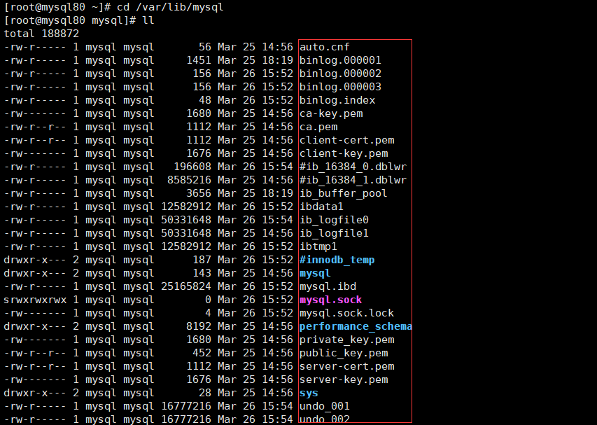
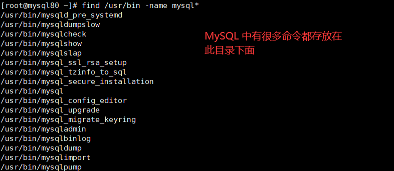
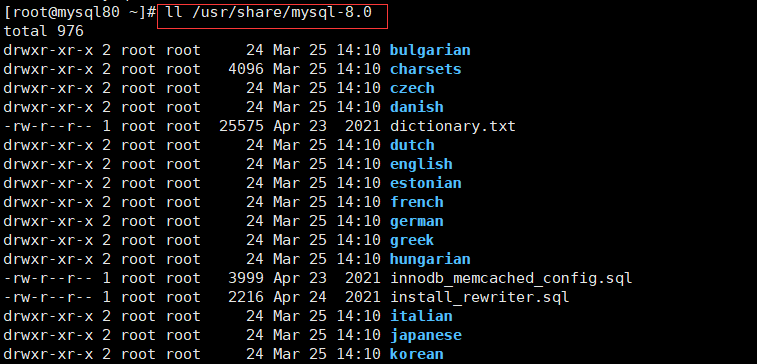
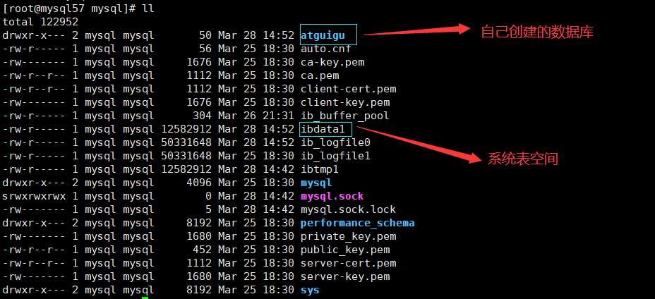
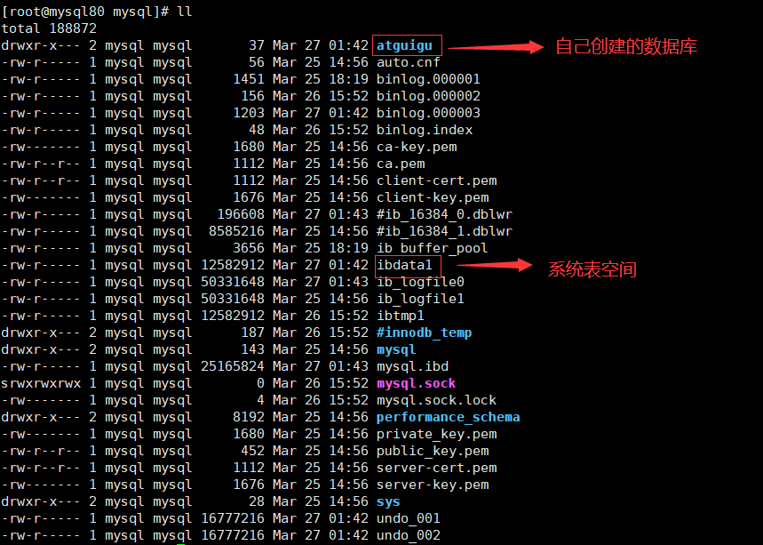
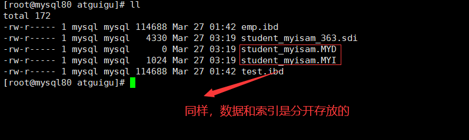

# 1. MySQL 8 的主要目录结构  
>[root@mysql80 ~]# find / -name mysql  

  

安装好 MySQL 8 之后，我们查看如下的目录结构：  

## 1.1 数据库文件的存放路径  
MySQL 服务器程序在启动时会到文件系统的某个目录下加载一些文件，之后在运行过程中产生的数据也都会存储到这个目录下的某些文件中，这个目录就称为 **数据目录**。  

MysQL 把数据都存到哪个路径下呢？其实数据目录对应着一个系统变量 datadir，我们在使用客户端与服务器建立连接之后查看这个系统变量的值就可以了：  

MySQL 数据库文件的存放路径：/var/lib/mysql/  

切换到该路径下进行查看：  
  

从上图中可以看出，sys、performance_schema 以及 mysql 等等，都是已经存在的数据库。  

## 1.2 相关命令存放的目录  
对于一个 Linux 程序而言，一般其命令文件都存放在 bin 和 sbin 目录下。而 MySQL 相关命令所在的目录为 /usr/bin（mysqladmin、mysqlbinlog、mysqldump等命令）和 /usr/sbin。  

  

  

## 1.3 配置文件目录  
配置文件目录：/usr/share/mysql-8.0（命令及配置文件），/etc/mysql（如my.cnf）  

  

# 2. 数据库和文件系统的关系
像 InnoDB、MyISAM 这样的存储引擎都是把表存储在磁盘上的，操作系统用来管理磁盘的结构被称为文件系统，所以用专业一点的话来表述就是：像 InnoDB、MyISAM 这样的存储引擎都是把表存储在文件系统上的。当我们想读取数据的时候，这些存储引擎会从文件系统中把数据读出来返回给我们，当我们想写入数据的时候，这些存储引擎会把这些数据又写回文件系统。本章学习一下 InnoDB 和 MyISAM 这两个存储引擎的数据如何在文件系统中存储。  

## 2.1 查看默认数据库  
查看一下在我的计算机上当前有哪些数据库：  
>mysql> show databases;  

  

可以看到有 4 个数据库是属于 MySQL 自带的系统数据库。  

mysql：  
MySQL 系统自带的核心数据库，它存储了 MySQL 的用户账户和权限信息，一些存储过程、事件的定义信息，一些运行过程中产生的日志信息，一些帮助信息以及时区信息等。  

比如：在 mysql 数据库中有一张 user 表，存储相关用户的相关信息
>select host, user from user;  

information_schema：  
MySQL 系统自带的数据库，这个数据库保存着 MySQL 服务器维护的 **所有其他数据库的信息**，比如有哪些表、哪些视图、哪些触发器、哪些列、哪些索引。这些信息并不是真实的用户数据，而是一些描述性信息，有时候也称之为 **元数据**。在系统数据库 information_schema 中提供了一些以 innodb_sys 开头的表，用于表示内部系统表。  

performance_schema：  
MySQL 系统自带的数据库，这个数据库里主要保存 MySQL 服务器运行过程中的一些状态信息，可以用来监控 MySQL 服务的各类性能指标。包括统计最近执行了哪些语句，在执行过程的每个阶段都花费了多长时间，内存的使用情况等信息。  

sys：  
MySQL 系统自带的数据库，这个数据库主要是通过 **视图** 的形式把 information_schema 和 performance_schema 结合起来，帮助系统管理员和开发人员监控 MySQL 的技术性能。  

## 2.2 数据库在文件系统中的表示  
使用 CREATE DATABASE 数据库名语句创建一个数据库的时候，在文件系统上实际发生了什么呢？其实很简单，每个数据库都对应数据目录下的一个子目录，或者说对应一个文件夹，每当新建一个数据库时，MySQL 会帮我们做这两件事儿：  

* 1.在数据目录下创建一个和数据库名同名的子目录。  
* 2.在与该数据库名同名的子目录下创建一个名为 db.opt 的文件（仅限 MySQL 5.7 及之前版本），这个文件中包含了该数据库的各种属性，比如该数据库的字符集和比较规则。  

在装有 mysql 5.7 的系统中：  
（1）切换到目录 /var/lib/mysql 下并进行查看，如下所示：  
    

（2）进入 atguigu 目录下进行查看，如下所示：  
  

在装有 mysql 8.0 的系统中：  
（1）切换到目录 /var/lib/mysql 下并进行查看，如下所示：  
  

（2）进入 atguigu 目录下进行查看，如下所示：  
  

通过比较可以发现在 mysql 8.0 中少了 .opt 和 .frm 文件。    

## 2.3 表在文件系统中的表示  
### 2.3.1 InnoDB 存储引擎模式  
（1）表结构：   
为了保存表结构，InnoDB 在 **数据目录** 下对应的数据库子目录下创建了一个专门用于 **描述表结构的文件**，文件名是这样：  

>表名.frm  

比方说我们在 atguigu 数据库下创建一个名为 test 的表，那在数据库 atguigu 对应的子目录下就会创建一个名为 test.frm 的用于描述表结构的文件。.frm 文件的格式在不同的平台上都是相同的。这个后缀名为 .frm 是以 **二进制格式** 存储的，我们直接打开是乱码的。  

（2）表中数据和索引：  
（2.1）系统表空间（system tablespace）  
默认情况下，InnoDB 会在数据目录下创建一个名为 ibdata1 、大小为 12M 的文件，这个文件就是对应的系统表空间 在文件系统上的表示。怎么才12M？注意这个文件是 自扩展文件 ，当不够用的时候它会自己增加文件大小。  

当然，如果你想让系统表空间对应文件系统上多个实际文件，或者仅仅觉得原来的 ibdata1 这个文件名难听，那可以在 MySQL 启动时配置对应的文件路径以及它们的大小，比如我们这样修改一下 my.cnf 配置文件：  

>[server]  
innodb_data_file_path=data1:512M;data2:512M:autoextend  

（2.2）独立表空间(file-per-table tablespace)  
在 MySQL 5.6.6 以及之后的版本中，InnoDB 并不会默认的把各个表的数据存储到系统表空间中，而是为每一个表建立一个独立表空间 ，也就是说我们创建了多少个表，就有多少个独立表空间。使用 独立表空间 来存储表数据的话，会在该表所属数据库对应的子目录下创建一个表示该独立表空间的文件，文件名和表名相同，只不过添加了一个 .ibd 的扩展名而已，所以完整的文件名称长这样：  

>表名.ibd  

比如：我们使用了 独立表空间 去存储 atguigu 数据库下的 test 表的话，那么在该表所在数据库对应的 atguigu 目录下会为 test 表创建这两个文件：  

>test.frm  
test.ibd  

其中 test.ibd 文件就用来存储 test 表中的 **数据和索引**，数据和索引存储在一起叫做 **聚集索引**。  

（2.3）系统表空间与独立表空间的设置  
我们可以自己指定使用 **系统表空间** 还是 **独立表空间** 来存储数据，这个功能由启动参数 innodb_file_per_table 控制，比如说我们想刻意将表数据都存储到 系统表空间 时，可以在启动 MySQL 服务器的时候这样配置：  

>[server]  
innodb_file_per_table=0 # 0：代表使用系统表空间； 1：代表使用独立表空间  

默认情况：  
>mysql> show variables like 'innodb_file_per_table';  
+-----------------------+-------+  
| Variable_name     | Value |  
+-----------------------+-------+  
| innodb_file_per_table | ON  |  
+-----------------------+-------+  
1 row in set (0.01 sec)  

（2.4）其他类型的表空间  
随着 MySQL 的发展，除了上述两种老牌表空间之外，现在还新提出了一些不同类型的表空间，比如通用表空间（general tablespace）、临时表空间（temporary tablespace）等。  

### 2.3.2 MyISAM存储引擎模式  
（1）表结构  
在存储表结构方面， MyISAM 和 InnoDB 一样，也是在 **数据目录** 下对应的数据库子目录下创建了一个专门用于描述表结构的文件：  

>表名.frm  

（2）表中数据和索引  
在 MyISAM 中的索引全部都是 **二级索引** ，该存储引擎的 **数据和索引是分开存放** 的。所以在文件系统中也是使用不同的文件来存储数据文件和索引文件，同时表数据都存放在对应的数据库子目录下。假如 test 表使用 MyISAM 存储引擎的话，那么在它所在数据库对应的 atguigu 目录下会为 test 表创建这三个文件：  

>test.frm  存储表结构  
test.MYD  存储数据 (MYData)  
test.MYI  存储索引 (MYIndex)  

举例：创建一个 MyISAM 表，使用 ENGINE 选项显式指定引擎。因为 InnoDB 是默认引擎。  

>CREATE TABLE student_myisam (  
id bigint NOT NULL AUTO_INCREMENT,  
name varchar(64) DEFAULT NULL,  
age int DEFAULT NULL,  
sex varchar(2) DEFAULT NULL,  
PRIMARY KEY (id)  
) ENGINE=MYISAM AUTO_INCREMENT=0 DEFAULT CHARSET=utf8mb3;  

在 MySQL 5.7 中创建该表格，对应的文件如下所示：  

  

在 MySQL 8.0 中创建该表格，对应的文件如下所示： 

  

## 2.4 小结  
举例：数据库 a，表 b。  
1、如果表 b 采用 InnoDB ，data\a 中会产生 1 个或者 2 个文件：  
>b.frm ：描述表结构文件，字段长度等  
> 
>如果采用 系统表空间 模式的，数据信息和索引信息都存储在 ibdata1 中  
> 
>如果采用 独立表空间 存储模式，data\a中还会产生 b.ibd 文件（存储数据信息和索引信息）  

此外：  
（1）MySQL 5.7 中会在 data/a 的目录下生成 db.opt 文件用于保存数据库的相关配置。比如：字符集、比较规则。而 MySQL 8.0 不再提供 db.opt 文件。  

（2）MySQL 8.0 中不再单独提供 b.frm，而是合并在 b.ibd 文件中。  

2、如果表 b 采用 MyISAM ，data\a 中会产生 3 个文件：  
>MySQL 5.7 中，b.frm：描述表结构文件，字段长度等。 
> 
>MySQL 8.0 中，b.xxx.sdi：描述表结构文件，字段长度等。  
> 
>b.MYD (MYData)：数据信息文件，存储数据信息（如果采用独立表存储模式）  
> 
>b.MYI (MYIndex)：存放索引信息文件

