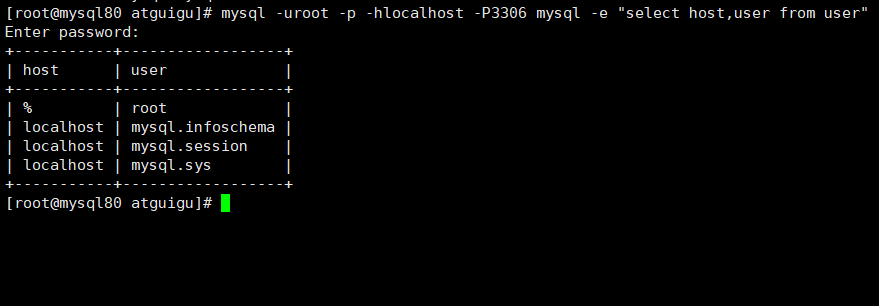
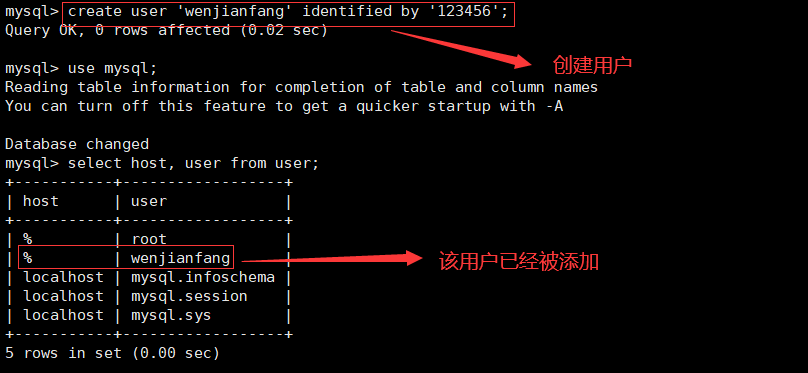
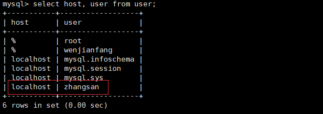
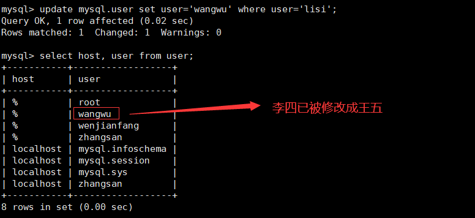
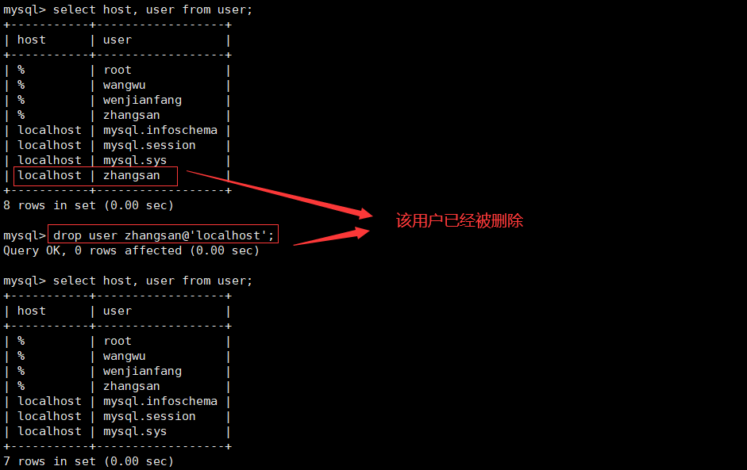
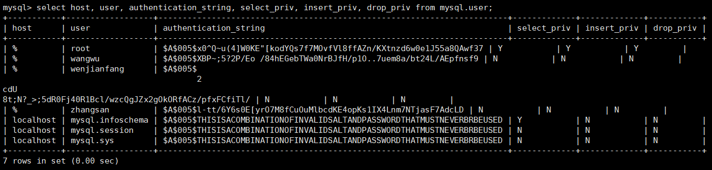
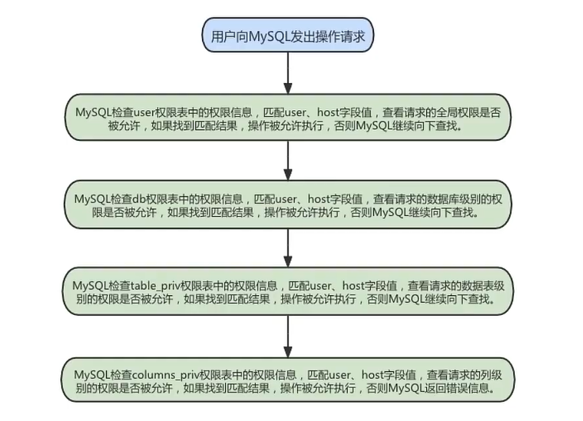
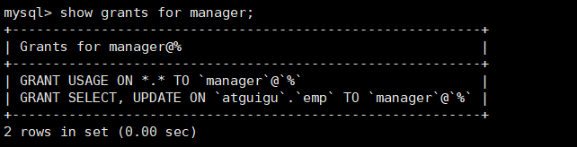
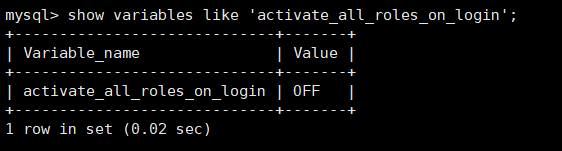

# 1. 用户管理  
MysQL 用户可以分为 **普通用户** 和 **root 用户**。root 用户是超级管理员，拥有所有权限，包括创建用户、删除用户和修改用户的密码等管理权限；普通用户只拥有被授予的各种权限。  

MySQL 提供了许多语句用来管理用户账号，这些语句可以用来管理包括登录和退出 MysQL 服务器、创建用户、删除用户、密码管理和权限管理等内容。

MySQL 数据库的安全性需要通过账户管理来保证。  

## 1.1 登录 MySQL 服务器  
启动 MySQL 服务后，可以通过 mysql 命令来登录 MySQL 服务器，命令如下：  
>mysql –h hostname / hostIP –P port –u username –p DatabaseName –e "SQL语句"  

下面详细介绍命令中的参数：  
* -h：后面接主机名或者主机 IP，hostname 为主机，hostIP 为主机 IP。  
* -P：后面接 MySQL 服务的端口，通过该参数连接到指定的端口。MySQL 服务的默认端口是 3306，不使用该参数时自动连接到 3306 端口，port 为连接的端口号。  
* -u：后面接用户名，username 为用户名。  
* -p：会提示输入密码。  
* DatabaseName：指明登录到哪一个数据库中。如果没有该参数，就会直接登录到 MySQL 数据库中，然后可以使用 USE 命令来选择数据库。  
* -e：后面可以直接加 SQL 语句。登录 MySQL 服务器以后即可执行这个 SQL 语句，然后退出 MySQL 服务器。  

举例：
>mysql -uroot -p -hlocalhost -P3306 mysql -e "select host,user from user"  

  

## 1.2 创建用户  
CREATE USER 语句的基本语法形式如下：  
>CREATE USER 用户名 [IDENTIFIED BY '密码'][,用户名 [IDENTIFIED BY '密码']];  

参数：  
* 用户名参数表示新建用户的账户，由 **用户（User）** 和 **主机名（Host）** 构成；  
* “[]”表示可选，也就是说，可以指定用户登录时需要密码验证，也可以不指定密码验证，这样用户可以直接登录。不过，不指定密码的方式不安全，不推荐使用。如果指定密码值，这里需要使用 IDENTIFIED BY指定明文密码值。  
* CREATE USER 语句可以同时创建多个用户。  

创建用户的时候不指定主机，默认是所有主机都可以使用该账号：  
>CREATE USER zhang3 IDENTIFIED BY '123123';  # 默认host是 %  

  

创建用户的时候指定主机：  
>create user zhangsan@'%' identified by '123456';  

  

## 1.3 修改用户  
修改用户名：  

将用户 李四 修改成 王五：
>update mysql.user set user='wangwu' where user='lisi';  
>flush privileges;   

  

## 1.4 删除用户  
方式 1：使用 drop 方式删除（推荐）  
使用 drop user 语句来删除用户时，必须拥有 drop user 权限。drop user 语句的基本语法形式如下：  

>drop user user1 [, user2]…;  

举例，删除 host 为 localhost 名为 zhangsan 的用户：  
>drop user zhangsan@'localhost';  

  

方式 2：使用 delete 方式删除  
>delete from mysql.user where host='hostname' and user='username';  

执行完 delete 命令后要使用 flush 命令来使用户生效，命令如下：  
>flush privileges;  

注意：不推荐通过 delete from 的方式进行删除，系统会有残留信息保留。而 drop user 命令会删除用户以及对应的权限，执行命令后你会发现 mysql.user 表和 mysql.db 表的相应记录都消失了。  

## 1.5 设置当前用户密码  
适用于 root 用户修改自己的密码，以及普通用户登录后修改自己的密码。  

root 用户拥有很高的权限，因此必须保证 root 用户的密码安全。root 用户可以通过多种方式来修改密码，使用 alter user 修改用户密码是 MySQL 官方推荐的方式。此外，也可以通过 set 语句修改密码。由于 MySQL 8.0 中已移除了 password() 函数，因此不再使用 update 语句直接操作用户表修改密码。  

旧的写法如下：  
>修改当前用户的密码：（MySQL 5.7 测试有效）  
set password = password('123456');  

这里介绍推荐的写法：

（1）使用 alter user 命令来修改当前用户密码  
用户可以使用 alter 命令来修改自身密码，如下语句代表修改当前登录用户的密码。基本语法如下：  
>alter user user() identified by 'new_password';  

（2）使用 set 语句来修改当前用户密码  
使用 root 用户登录 MySQL 后，可以使用 set 语句来修改密码，具体 sql 语句如下：  
>set password='new_password';  

该语句会自动将密码加密后再赋给当前用户。  

## 1.6 修改其它用户密码  
（1）使用 alter 语句来修改普通用户的密码  
可以使用 alter user 语句来修改普通用户的密码。基本语法形式如下：  
>alter user user1 [identified by '新密码'][,user2[identified by '新密码']]…;  

（2）使用 set 命令来修改普通用户的密码  
使用 root 用户登录到 MySQL 服务器后，可以使用 set 语句来修改普通用户的密码。set 语句的代码如下：  
>set password for 'username'@'hostname'='new_password';  

（3）使用 update 语句修改普通用户的密码（不推荐）  
>update mysql.user set authentication_string=password("123456")
where user = 'username' and Host = 'hostname';  

## 1.7 MySQL 8.0 密码管理(了解)
MysQL 中记录使用过的历史密码，目前包含如下密码管理功能：  
* 密码过期：要求定期修改密码。  
* 密码重用限制：不允许使用旧密码。  
* 密码强度评估：要求使用高强度的密码。（第 1 章已讲）

（1）密码过期策略  
* 在 MySQL 中，数据库管理员可以 **手动设置** 账号密码过期，也可以建立一个 **自动** 密码过期策略。  
* 过期策略可以是 **全局的**，也可以为 **每个账号** 设置单独的过期策略。  
>alter user user1 password expire;  

练习：  
>alter user 'kangshifu'@'localhost' password expire;  

方式 1：使用 SQL 语句更改该变量的值并持久化  
>set persist default_password_lifetime = 180; # 建立全局策略，设置密码每隔 180 天过期  

方式 2：配置文件 my.cnf 中进行维护
>[mysqld]  
default_password_lifetime=180 # 建立全局策略，设置密码每隔 180 天过期  

手动设置指定时间过期方式 2：单独设置  
每个账号既可延用全局密码过期策略，也可单独设置策略。在 create user 和 alter user 语句上加入 password expire 选项可实现单独设置策略。下面是一些语句示例。  

>设置 kangshifu 账号密码每 90 天过期：  
create user 'kangshifu'@'localhost' password expire interval 90 day;  
alter user 'kangshifu'@'localhost' password expire interval 90 day;
>
>设置密码永不过期：  
create user 'kangshifu'@'localhost' password expire never;  
alter user 'kangshifu'@'localhost' password expire never;  
>
>延用全局密码过期策略：  
create user 'kangshifu'@'localhost' password expire default;  
alter user 'kangshifu'@'localhost' password expire default;  

（2）密码重用策略  
MySQL 限制使用已用过的密码。重用限制策略基于 **密码更改的数量和使用的时间**。重用策略可以是全局的，也可以为每个账号设置单独的策略。  

（1）账号的历史密码包含过去该账号所使用的密码。MySQL 基于以下规则来限制密码重用：  
* 如果账号的密码限制基于密码更改的数量，那么新密码不能从最近限制的密码数量中选择。例如，如果密码更改的最小值为 3，那么新密码不能与最近 3 个密码中任何一一个相同。  
  

* 如果账号密码限制基于时间，那么新密码不能从规定时间内选择。例如，如果密码重用周期为 60 天，那么新密码不能从最近 60 天内使用的密码中选择。

（2）MySQL 使用 password_history 和 password_reuse_interval 系统变量设置密码重用策略。  
* password_history：规定密码重用的数量  

* password_reuse_interval：规定密码重用的周期

（3）这两个值可在服务器的配置文件中进行维护，也可在运行期间使用 SQL 语句更改该变量的值并持久化。  

# 2. 权限管理  
关于 MySQL 的权限简单的理解就是 MySQL **允许你做你权力以内的事情**，不可以越界。比如只允许你执行 select 操作，那么你就不能执行 update 操作。只允许你从某台机器上连接 MySQL，那么你就不能从除那台机器以外的其他机器连接 MySQL。  

## 2.1 权限列表  
MySQL 到底都有哪些权限呢？  
>show privileges;  

grant 和 revoke 语句中可以使用的权限如下（下表中只显示部分权限）：  

| 权限    | user 表对应的列 | 权限的范围     |
| :---    | :----    | :---    |
| create    | create_priv  | 数据库、表或索引   |
| drop      | drop_priv    | 数据库、表或视图   |
| grant option    | grant_priv  | 数据库、表或存储过程   |
| alter      | alter_priv    | 数据库   |
| delete    | delete_priv  | 表   |
| index     | index_priv    | 表  |
| insert     | insert_priv    | 表  |

（1） create 和 drop 权限，可以创建新的数据库和表，或删除（移掉）已有的数据库和表。如果将 MySQL 数据库中的 drop 权限授予某用户，用户就可以删除 MySQL 访问权限保存的数据库。  

（2） select、insert、update 和 delete 权限，允许在一个数据库现有的表上实施操作。  

（3） select 权限，只有在它们真正从一个表中检索行时才被用到。  

（4） index 权限，允许创建或删除索引，index 适用于已有的表。如果具有某个表的 create 权限，就可以在 create table 语句中包括索引定义。  

（5） alter 权限，可以使用 alter table 来更改表的结构和重新命名表。  

（6） create routine 权限，用来创建保存的程序（函数和程序），alter routine 权限用来更改和删除保存的程序， execute 权限用来执行保存的程序。  

（7） grant 权限，允许授权给其他用户，可用于数据库、表和保存的程序。  

（8） file 权限，使用户可以使用 load data infile 和 select ... into outfile 语句读或写服务器上的文件，任何被授予 file 权限的用户都能读或写 MySQL 服务器上的任何文件（说明用户可以读任何数据库目录下的文件，因为服务器可以访问这些文件）。  

**MySQL 的权限如何分布：**

| 权限分布    | 可能设置的权限  |
| :---    | :----    |
| 表权限    | 'Select', 'Insert', 'Update', 'Delete', 'Create', 'Drop', 'Grant', 'References', 'Index', 'Alter' |
| 列权限    | 'Select', 'Insert', 'Update', 'References'  |
| 过程权限  | 'Execute', 'Alter Routine', 'Grant'  |

## 2.2 授予权限的原则  
权限控制主要是出于安全因素，因此需要遵循以下几个 经验原则：

（1）只授予能 **满足需要的最小权限**，防止用户干坏事。比如用户只是需要查询，那就只给 select 权限就可以了，不要给用户赋予 update、insert 或者 delete 权限。  

（2）创建用户的时候 **限制用户的登录主机**，一般是限制成指定 IP 或者内网 IP 段。  

（3）为每个用户 **设置满足密码复杂度的密码**。  

（4）**定期清理不需要的用户**，回收权限或者删除用户。  

## 2.3 授予权限  
给用户授权的方式有 2 种，分别是通过把 **角色赋予用户给用户授权** 和 **直接给用户授权**。用户是数据库的使用者，我们可以通过给用户授予访问数据库中资源的权限，来控制使用者对数据库的访问，消除安全隐患。  

授权命令：  
>grant 权限 1, 权限 2, …, 权限 n on 数据库名称.表名称 to 用户名@用户地址 [identified by ‘密码口令’];   

**该权限如果发现没有该用户，则会直接新建一个用户。**  

比如：  
给 lisi 用户用本地命令行方式，授予 atguigudb 这个库下的所有表的插删改查的权限。  
>grant select, insert, delete, update on atguigudb.* to lisi@localhost;  

授予通过网络方式登录的 joe 用户，对所有库所有表的全部权限，密码设为 123。注意这里唯独不包括 grant 的权限  
>grant all privileges on \*.* to joe@'%' identified by '123';  

* all privileges 是表示所有权限，你也可以使用 select、update 等权限。  
  

* on 用来指定权限针对哪些库和表。  

  
* . 中前面的 \* 号用来指定数据库名，后面的 \* 号用来指定表名，这里的 \* 表示所有的。  
   

* to 表示将权限赋予某个用户。  
  

* lisi@'localhost' 表示 lisi 用户，@ 后面接限制的主机，可以是 ip 或 ip 段、域名以及 %，% 表示任何地方。注意：这里%有的版本不包括本地，以前碰到过给某个用户设置了 % 允许任何地方登录，但是在本地登录不了，这个和版本有关系,遇到这个问题再加一个 localhost 的用户就可以了。  
  

* identified by 指定用户的登录密码。  

如果需要赋予包括 grant 的权限，添加参数 with grant option 这个选项即可，表示该用户可以将自己拥有的权限授权给别人。经常有人在创建操作用户的时候不指定 with grant option 选项导致后来该用户不能使用 grant 命令创建用户或者给其它用户授权。  

可以使用 grant 重复给用户添加权限，权限叠加，比如你先给用户添加一个 select 权限，然后又给用户添加一个 insert 权限，那么该用户就同时拥有了 select 和 insert 权限。  

我们在开发应用的时候，经常会遇到一种需求，就是要根据用户的不同，对数据进行横向和纵向的分组。  

（1）所谓横向的分组，就是指用户可以接触到的数据的范围，比如可以看到哪些表的数据；  
（2）所谓纵向的分组，就是指用户对接触到的数据能访问到什么程度，比如能看、能改，甚至是删除。  

## 2.4 查看权限  
查看当前用户权限：  
>show grants;  
> 
>或 show grants for current_user;  
>
>或 show grants for current_user();  

查看某用户的全局权限：  
>show grants for 'user'@'主机地址';  

## 2.5 收回权限  
收回权限就是取消已经赋予用户的某些权限。收回用户不必要的权限可以在一定程度上保证系统的安全性。MySQL 中使用 revoke 语句 取消用户的某些权限。使用 revoke 收回权限之后，用户账户的记录将从 db、host、tables_priv 和 columns_priv 表中删除，但是用户账户记录仍然在 user 表中保存（删除 user 表中的账户记录使用 drop user 语句）。  

注意：在将用户账户从 user 表删除之前，应该收回相应用户的所有权限。  

收回权限命令：  
>revoke 权限 1, 权限 2, …, 权限 n on 数据库名称.表名称 from 用户名@用户地址;  

举例：  
>收回全库全表的所有权限  
revoke all privileges on \*.* from joe@'%';  
>
>收回 mysql 库下的所有表的插删改查权限  
revoke select, insert, update, delete on mysql.* from joe@localhost;  

# 3. 权限表  
MySQL 服务器通过权限表来控制用户对数据库的访问，权限表存放在 mysql 数据库中。MySQL 数据库系统会根据这些权限表的内容为每个用户赋予相应的权限。这些权限表中最重要的是 user 表、db 表。除此之外，还有 table_priv 表、column_priv 表和 proc_priv 表等。在 MySQL 启动时，服务器将这些数据库表中权限信息的内容读入内存。  

## 3.1 user 表  
user 表是 MySQL 中最重要的一个权限表，记录用户账号和权限信息，有 49 个字段，如下图：    

| Field                    | Type                              | Null | Key | Default               | Extra |
| :---    | :----    | :---    | :----    | :---    | :----    |
| **Host**                     | char(255)                         | NO   | PRI |                       |       |
| **User**                     | char(32)                          | NO   | PRI |                       |       |
| Select_priv              | enum('N','Y')                     | NO   |     | N                     |       |
| Insert_priv              | enum('N','Y')                     | NO   |     | N                     |       |
| Update_priv              | enum('N','Y')                     | NO   |     | N                     |       |
| Delete_priv              | enum('N','Y')                     | NO   |     | N                     |       |
| Create_priv              | enum('N','Y')                     | NO   |     | N                     |       |
| Drop_priv                | enum('N','Y')                     | NO   |     | N                     |       |
| Reload_priv              | enum('N','Y')                     | NO   |     | N                     |       |
| Shutdown_priv            | enum('N','Y')                     | NO   |     | N                     |       |
| Process_priv             | enum('N','Y')                     | NO   |     | N                     |       |
| File_priv                | enum('N','Y')                     | NO   |     | N                     |       |
| Grant_priv               | enum('N','Y')                     | NO   |     | N                     |       |
| References_priv          | enum('N','Y')                     | NO   |     | N                     |       |
| Index_priv               | enum('N','Y')                     | NO   |     | N                     |       |
| Alter_priv               | enum('N','Y')                     | NO   |     | N                     |       |
| Show_db_priv             | enum('N','Y')                     | NO   |     | N                     |       |
| Super_priv               | enum('N','Y')                     | NO   |     | N                     |       |
| Create_tmp_table_priv    | enum('N','Y')                     | NO   |     | N                     |       |
| Lock_tables_priv         | enum('N','Y')                     | NO   |     | N                     |       |
| Execute_priv             | enum('N','Y')                     | NO   |     | N                     |       |
| Repl_slave_priv          | enum('N','Y')                     | NO   |     | N                     |       |
| Repl_client_priv         | enum('N','Y')                     | NO   |     | N                     |       |
| Create_view_priv         | enum('N','Y')                     | NO   |     | N                     |       |
| Show_view_priv           | enum('N','Y')                     | NO   |     | N                     |       |
| Create_routine_priv      | enum('N','Y')                     | NO   |     | N                     |       |
| Alter_routine_priv       | enum('N','Y')                     | NO   |     | N                     |       |
| Create_user_priv         | enum('N','Y')                     | NO   |     | N                     |       |
| Event_priv               | enum('N','Y')                     | NO   |     | N                     |       |
| Trigger_priv             | enum('N','Y')                     | NO   |     | N                     |       |
| Create_tablespace_priv   | enum('N','Y')                     | NO   |     | N                     |       |
| ssl_type                 | enum('','ANY','X509','SPECIFIED') | NO   |     |                       |       |
| ssl_cipher               | blob                              | NO   |     | NULL                  |       |
| x509_issuer              | blob                              | NO   |     | NULL                  |       |
| x509_subject             | blob                              | NO   |     | NULL                  |       |
| max_questions            | int unsigned                      | NO   |     | 0                     |       |
| max_updates              | int unsigned                      | NO   |     | 0                     |       |
| max_connections          | int unsigned                      | NO   |     | 0                     |       |
| max_user_connections     | int unsigned                      | NO   |     | 0                     |       |
| plugin                   | char(64)                          | NO   |     | caching_sha2_password |       |
| **authentication_string**    | text                              | YES  |     | NULL                  |       |
| password_expired         | enum('N','Y')                     | NO   |     | N                     |       |
| password_last_changed    | timestamp                         | YES  |     | NULL                  |       |
| password_lifetime        | smallint unsigned                 | YES  |     | NULL                  |       |
| account_locked           | enum('N','Y')                     | NO   |     | N                     |       |
| Create_role_priv         | enum('N','Y')                     | NO   |     | N                     |       |
| Drop_role_priv           | enum('N','Y')                     | NO   |     | N                     |       |
| Password_reuse_history   | smallint unsigned                 | YES  |     | NULL                  |       |
| Password_reuse_time      | smallint unsigned                 | YES  |     | NULL                  |       |
| Password_require_current | enum('N','Y')                     | YES  |     | NULL                  |       |
| User_attributes          | json                              | YES  |     | NULL                  |       |

其中，host，user 以及 authentication_string 是需要注意的三个字段。  

这些字段可以分成 4 类，分别是：**范围列（或用户列）、权限列、安全列和资源控制列**。  

1、范围列（或用户列）    
host：表示连接类型  
* %，表示所有远程通过 tcp 方式的连接  

* ip 地址，如 (192.168.1.2、127.0.0.1) 通过制定 ip 地址进行的 tcp 方式的连接  

* 机器名，通过制定网络中的机器名进行的 tcp 方式的连接  

* ::1，ipv6 的本地 ip 地址，等同于 ipv4 的 127.0.0.1  

* localhost，本地方式通过命令行方式的连接，比如 mysql -u xxx -p xxx 方式的连接。  

user：表示用户名，同一用户通过不同方式链接的权限是不一样的。  

password：密码  

* 所有密码串通过 password（明文字符串）生成的密文字符串。MySQL 8.0 在用户管理方面增加了角色管理，默认的密码加密方式也做了调整，由之前的 SHA1 改为了 SHA2，不可逆 。同时加上 MySQL 5.7 的禁用用户和用户过期的功能，MySQL 在用户管理方面的功能和安全性都较之前版本大大的增强了。  

* mysql 5.7 及之后版本的密码保存到 authentication_string 字段中不再使用 password 字段。  

2、权限列  
Grant_priv 字段：表示是否拥有 grant 权限  

Shutdown_priv 字段：表示是否拥有停止 MySQL 服务的权限  
   
Super_priv 字段：表示是否拥有超级权限  

Execute_priv 字段：表示是否拥有 execute 权限。拥有 execute 权限，可以执行存储过程和函数。  

Select_priv，Insert_priv 等：为该用户所拥有的权限。  

3、安全列  
安全列只有 6 个字段，其中两个是 ssl 相关的（ssl_type、ssl_cipher），用于加密；两个是 x509 相关的（x509_issuer、x509_subject），用于标识用户；另外两个 Plugin 字段用于验证用户身份的插件，该字段不能为空。如果该字段为空，服务器就使用内建授权验证机制验证用户身份。  

4、资源控制列    
资源控制列的字段用来 **限制用户使用的资源**，包含 4 个字段，分别为：  

max_questions：用户每小时允许执行的查询操作次数；  
max_updates：用户每小时允许执行的更新操作次数；  
max_connections：用户每小时允许执行的连接操作次数；  
max_user_connections：用户允许同时建立的连接次数。  

查询特定字段：  
>select   
>&emsp;host, user, authentication_string, select_priv, insert_priv, drop_priv   
>from  
>&emsp;mysql.user;

  

## 3.2 db 表  
使用 desc/describe 查看 db 表的基本结构：  
>desc/describe mysql.db;  

| Field                 | Type          | Null | Key | Default | Extra |
| :---    | :----    | :---    | :----    | :---    | :----    |
| Host                  | char(255)     | NO   | PRI |         |       |
| Db                    | char(64)      | NO   | PRI |         |       |
| User                  | char(32)      | NO   | PRI |         |       |
| Select_priv           | enum('N','Y') | NO   |     | N       |       |
| Insert_priv           | enum('N','Y') | NO   |     | N       |       |
| Update_priv           | enum('N','Y') | NO   |     | N       |       |
| Delete_priv           | enum('N','Y') | NO   |     | N       |       |
| Create_priv           | enum('N','Y') | NO   |     | N       |       |
| Drop_priv             | enum('N','Y') | NO   |     | N       |       |
| Grant_priv            | enum('N','Y') | NO   |     | N       |       |
| References_priv       | enum('N','Y') | NO   |     | N       |       |
| Index_priv            | enum('N','Y') | NO   |     | N       |       |
| Alter_priv            | enum('N','Y') | NO   |     | N       |       |
| Create_tmp_table_priv | enum('N','Y') | NO   |     | N       |       |
| Lock_tables_priv      | enum('N','Y') | NO   |     | N       |       |
| Create_view_priv      | enum('N','Y') | NO   |     | N       |       |
| Show_view_priv        | enum('N','Y') | NO   |     | N       |       |
| Create_routine_priv   | enum('N','Y') | NO   |     | N       |       |
| Alter_routine_priv    | enum('N','Y') | NO   |     | N       |       |
| Execute_priv          | enum('N','Y') | NO   |     | N       |       |
| Event_priv            | enum('N','Y') | NO   |     | N       |       |
| Trigger_priv          | enum('N','Y') | NO   |     | N       |       |

1、用户列   
db 表用户列有 3 个字段，分别是 Host、User、Db。这 3 个字段分别表示主机名、用户名和数据库名。表示从某个主机连接某个用户对某个数据库的操作权限，这 3 个字段的组合构成了 db 表的主键。  

2、权限列  
Create_routine_priv 和 Alter_routine_priv 这两个字段决定用户是否具有创建和修改存储过程的权限。  

## 3.3 tables_priv 表和 columns_priv 表  
tables_priv 表用来 **对表设置操作权限**，columns_priv 表用来对表的 **某一列设置权限**。tables_priv 表和 columns_priv 表的结构分别如图：  
>desc mysql.tables_priv;  

tables_priv 表有 8 个字段，分别是 Host、Db、User、Table_name、Grantor、Timestamp、Table_priv 和 Column_priv，各个字段说明如下：  

* Host、Db、User 和 Table_name 四个字段分别表示主机名、数据库名、用户名和表名。  
* Grantor 表示修改该记录的用户。  
* Timestamp 表示修改该记录的时间。  
* Table_priv 表示对象的操作权限。包括：Select、Insert、Update、Delete、Create、Drop、Grant、References、Index 和 Alter。  
* Column_priv 字段表示对表中的列的操作权限，包括：Select、Insert、Update 和 References。  

>desc mysql.columns_priv;  

## 3.4 procs_priv 表  
procs_priv表可以对 **存储过程和存储函数设置操作权限**，表结构如图：  
>desc mysql.procs_priv;  

| Field        | Type                                   | Null | Key | Default           | Extra                                         |
| :---    | :----    | :---    | :----    | :---    | :----    |
| Host         | char(255)                              | NO   | PRI |                   |                                               |
| Db           | char(64)                               | NO   | PRI |                   |                                               |
| User         | char(32)                               | NO   | PRI |                   |                                               |
| Routine_name | char(64)                               | NO   | PRI |                   |                                               |
| Routine_type | enum('FUNCTION','PROCEDURE')           | NO   | PRI | NULL              |                                               |
| Grantor      | varchar(288)                           | NO   | MUL |                   |                                               |
| Proc_priv    | set('Execute','Alter Routine','Grant') | NO   |     |                   |                                               |
| Timestamp    | timestamp                              | NO   |     | CURRENT_TIMESTAMP | DEFAULT_GENERATED on update CURRENT_TIMESTAMP |

# 4. 访问控制（了解）  
正常情况下，并不希望每个用户都可以执行所有的数据库操作。当 MysQL 允许一个用户执行各种操作时，它将首先核实该用户向 MysQL 服务器发送的连接请求，然后确认用户的操作请求是否被允许。这个过程称为 MysQL 中的访问控制过程。MySQL 的访问控制分为两个阶段：**连接核实阶段** 和 **请求核实阶段**。  

## 4.1 连接核实阶段  
当用户试图连接 MySQL 服务器时，服务器基于用户的身份以及用户是否能提供正确的密码验证身份来确定接受或者拒绝连接。即客户端用户会在连接请求中提供用户名、主机地址、用户密码，MySQL 服务器接收到用户请求后，会使用 **user 表中的 host、user 和 authentication_string 这 3 个字段匹配客户端提供信息**。    

服务器只有在 user 表记录的 Host 和 User 字段匹配客户端主机名和用户名，并且提供正确的密码时才接受连接。**如果连接核实没有通过，服务器就完全拒绝访问；否则，服务器接受连接，然后进入阶段 2 等待用户请求**。  

## 4.2 请求核实阶段  
一旦建立了连接，服务器就进入了访问控制的阶段 2，也就是请求核实阶段。对此连接上进来的每个请求，服务器检查该请求要执行什么操作、是否有足够的权限来执行它，这正是需要授权表中的权限列发挥作用的地方。这些权限可以来自 user、db、table_priv 和 column_priv 表。  

确认权限时，MySQL 首先检查 user 表，如果指定的权限没有在 user 表中被授予，那么 MySQL 就会继续检查 db 表，db 表是下一安全层级，其中的权限限定于数据库层级，在该层级的 select 权限允许用户查看指定数据库的所有表中的数据；如果在该层级没有找到限定的权限，则 MySQL 继续检查 tables_priv 表以及 columns_priv 表，如果所有权限表都检查完毕，但还是没有找到允许的权限操作，MySQL 将返回错误信息，用户请求的操作不能执行，操作失败。  

提示： MySQL 通过向下层级的顺序（从 user 表到 columns_priv 表）检查权限表，但并不是所有的权限都要执行该过程。例如，一个用户登录到 MySQL 服务器之后只执行对 MySQL 的管理操作，此时只涉及管理权限，因此 MySQL 只检查 user 表。另外，如果请求的权限操作不被允许，MySQL 也不会继续检查下一层级的表。  

  

# 5. 角色管理
## 5.1 角色的理解  
角色是在 MySQL 8.0 中引入的新功能。在 MysQL 中，**角色是权限的集合**，可以为角色添加或移除权限。用户可以被赋予角色，同时也被授予角色包含的权限。对角色进行操作需要较高的权限。并且像用户账户一样，角色可以拥有授予和撤消的权限。  

引入角色的目的是 **方便管理拥有相同权限的用户**。恰当的权限设定，可以确保数据的安全性，这是至关重要的。  

  

## 5.2 创建角色  
在实际应用中，为了安全性，需要给用户授予权限。当用户数量较多时，为了避免单独给每一个用户授予多个权限，可以先将权限集合放入角色中，再赋予用户相应的角色。  

创建角色使用 create role 语句，语法如下：  
>create role 'role_name'[@'host_name'] [,'role_name'[@'host_name']]...  

角色名称的命名规则和用户名类似。如果 host_name 省略，默认为 %，role_name 不可省略，不可为空。  

练习：我们现在需要创建一个经理的角色，就可以用下面的代码  
>create role 'manager'@'localhost';  

这里创建了一个角色，角色名称是：manager，角色可以登录的主机是：localhost，意思是只能从数据库服务器运行的这台计算机登录这个账号。你也可以不写主机名，直接创建角色：manager：  
>create role 'manager';  

如果不写主机名，MySQL 默认是通配符 %，意思是这个账号可以从任何一台主机上登录数据库。  
同样道理，如果我们要创建库管的角色，就可以用下面的代码：  
>create role 'stocker';  

## 5.3 给角色赋予权限  
创建角色之后，默认这个角色是没有任何权限的，我们需要给角色授权。给角色授权的语法结构是：  
>grant privileges on table_name to 'role_name'[@'host_name'];  

上述语句中 privileges 代表权限的名称，多个权限以逗号隔开。  

练习 1：我们现在想给经理角色授予商品信息表、盘点表和应付账款表的只读权限，就可以用下面的代码来实现  
>grant select on atguigu.emp to 'manager';  
>grant update on atguigu.emp to 'manager';  

## 5.4 查看角色的权限  
赋予角色权限之后，我们可以通过 show grants 语句，来查看权限是否创建成功了：  
>show grants for manager;  

  

只要你创建了一个角色，系统就会自动给你一个 USAGE 权限，**意思是连接登录数据库的权限**。  

## 5.5 回收角色的权限  
角色授权后，可以对角色的权限进行维护，对权限进行添加或撤销。添加权限使用 grant 语句，与角色授权相同。撤销角色或角色权限使用 revoke 语句。  

修改了角色的权限，会影响拥有该角色的账户的权限。  

撤销角色权限的 sql 语法如下：  
>revoke privileges on tablename from 'rolename';  

## 5.6 删除角色  
当我们需要对业务重新整合的时候，可能就需要对之前创建的角色进行清理，删除一些不会再使用的角色。删除角色的操作很简单，你只要掌握语法结构就行了。  
>drop role role1 [, role2]...  

注意：如果你删除了角色，那么用户也就失去了通过这个角色所获得的所有权限。  

## 5.7 给用户赋予角色  
角色创建并授权后，要赋给用户并处于 **激活状态** 才能发挥作用。给用户添加角色可使用 grant 语句，语法形式如下：  
>grant role1 [, role2, ...] to user [, user2, ...];  

在上述语句中，role 代表角色，user 代表用户。可将多个角色同时赋予多个用户，用逗号隔开即可。  

## 5.8 激活角色  
方式 1：使用 set default role 命令激活角色  
举例：  
>set default role all to 'kangshifu'@'localhost';  

方式 2：将 activate_all_roles_on_login 设置为 on  
查看默认角色：  
>show variables like 'activate_all_roles_on_login';  

  

设置：  
>set global activate_all_roles_on_login=on;  

这条 sql 语句的意思是，对 **所有角色永久激活**。运行这条语句之后，用户才真正拥有了赋予角色的所有权限。  

查看当前已激活的角色：  
>select current_role();  

## 5.9 撤销用户的角色  
撤销用户角色的 sql 语法如下：  
>revoke role from user;  

## 5.10 设置强制角色（mandatory role）  
方式 1：服务启动前设置  
>[mysqld]  
mandatory_roles='role1,role2@localhost,r3@%.atguigu.com'  

方式 2：运行时设置  
>set persist mandatory_roles = 'role1,role2@localhost,r3@%.example.com'; #系统重启后仍然有效
> 
>set global mandatory_roles = 'role1,role2@localhost,r3@%.example.com'; #系统重启后失效  

# 6. 配置文件的使用  
## 6.1 配置文件格式  
与在命令行中指定启动选项不同的是，配置文件中的启动选项被划分为若干个组，每个组有一个组名，用中括号 [] 扩起来，像这样：  
>[server]  
(具体的启动选项...)  
> 
>[mysqld]  
(具体的启动选项...)  
> 
>[mysqld_safe]
 (具体的启动选项...)    
>
>[client]  
(具体的启动选项...)  
> 
>[ mysql]  
(具体的启动选项...)  
> 
>[mysqladmin]  
(具体的启动选项...)  

像这个配置文件里就定义了许多个组，组名分别是 server、mysqld、mysqld_safe、client、mysql、mysqladmin。每个组下边可以定义若干个启动选项，我们以 [server] 组为例来看一下填写启动选项的形式（其他组中启动选项的形式是一样的）：  
>[server]  
> option1        # 这是option1，该选项不需要选项值  
option2=value2   # 这是option2，该选项需要选项值  

在配置文件中指定启动选项的语法类似于命令行语法，但是配置文件中指定的启动选项不允许加 -- 前缀，并且每行只指定一个选项，而且 = 周围可以有空白字符（命令行中选项名、=、选项值之间不允许有空白字符）。另外，在配置文件中，我们可以使用 # 来添加注释，从 # 出现直到行尾的内容都属于注释内容，读取配置文件时会忽略这些注释内容。  

## 6.2 启动命令与选项组  
配置文件中不同的选项组是给不同的启动命令使用的。不过有两个选项组比较特别：  
* [server] 组下边的启动选项将作用于所有的服务器程序。  
* [client] 组下边的启动选项将作用于所有的客户端程序。  
  
下面是启动命令能读取的选项组都有哪些：  

| 启动命令      | 类别 | 能读取的组     |
|    :---     |    :----   |    :---    |
| mysqld      | 启动服务器       | [mysqld]、[server]   |
| mysqld_safe   | 启动服务器        | [mysqld]、[server]、[mysqld_safe]    |
| mysql.server   | 启动服务器       | [ mysqld]、[server]、[mysql.server]    |
| mysql   | 启动客户端        | [mysql]、[client]    |
| mysqladmin   | 启动客户端        | [mysqladmin]、[client]    |
| mysqldump   | 启动客户端       | [mysqldump]、 [client]    |

比如，在 /etc/mysql/my.cnf 这个配置文件中添加一些内容：  
>[server]  
skip-networking  
default-storage-engine=MyISAM  

然后直接用 mysqld 启动服务器程序：  
>mysqld  

虽然在命令行没有添加启动选项，但是在程序启动的时候，就会默认的到我们上边提到的配置文件路径下查找配置文件，其中就包括 /etc/my.cnf。又由于 mysqld 命令可以读取 [server] 选项组的内容，所以 skip-networking 和 default-storage-engine=MyISAM 这两个选项是生效的。你可以把这些启动选项放在 [client] 组里再试试用 mysqld 启动服务器程序，就不生效。  

## 6.3 特定 MySQL 版本的专用选项组  
我们可以在选项组的名称后加上特定的 MySQL 版本号，比如对于 [mysqld] 选项组来说，我们可以定义一个 [mysqld-5.7] 的选项组，它的含义和 [mysqld] 一样，只不过只有版本号为 5.7 的 mysqld 程序才能使用这个选项组中的选项。  

## 6.4 同一个配置文件中多个组的优先级  
我们说同一个命令可以访问配置文件中的多个组，比如 mysqld 可以访问 [mysqld]、[server] 组，如果在同一个配置文件中，比如 ~/.my.cnf，在这些组里出现了同样的配置项，比如这样：  
>[server]  
default-storage-engine=InnoDB  
> 
>[mysqld]  
default-storage-engine=MyISAM  

那么，将以 **最后一个** 出现的组中的启动选项为准。  

## 6.5 命令行和配置文件中启动选项的区别  
在命令行上指定的绝大部分启动选项都可以放到配置文件中，但是有一些选项是专门为命令行设计的，比方说 defaults-extra-file、defaults-file 这样的选项本身就是为了指定配置文件路径的，再放在配置文件中使用就没啥意义了。  

如果同一个启动选项既出现在命令行中，又出现在配置文件中，那么以命令行中的启动选项为准!比如我们在配置文件中写了：  
>[ server]  
default-storage-engine=InnoDB  

