# 1. 逻辑架构剖析  
## 1.1 服务器处理客户端请求  
首先 MysQL 是典型的 c/s 架构，即 **Client/Server** 架构，服务器端程序使用的 **mysqld**。  

不论客户端进程和服务器进程是采用哪种方式进行通信，最后实现的效果都是：**客户端进程向服务器进程发送一段文本（sql 语句），服务器进程处理后再向客户端进程发送一段文本（处理结果）**。

那服务器进程对客户端进程发送的请求做了什么处理，才能产生最后的处理结果呢？这里以查询请求为例展示：  

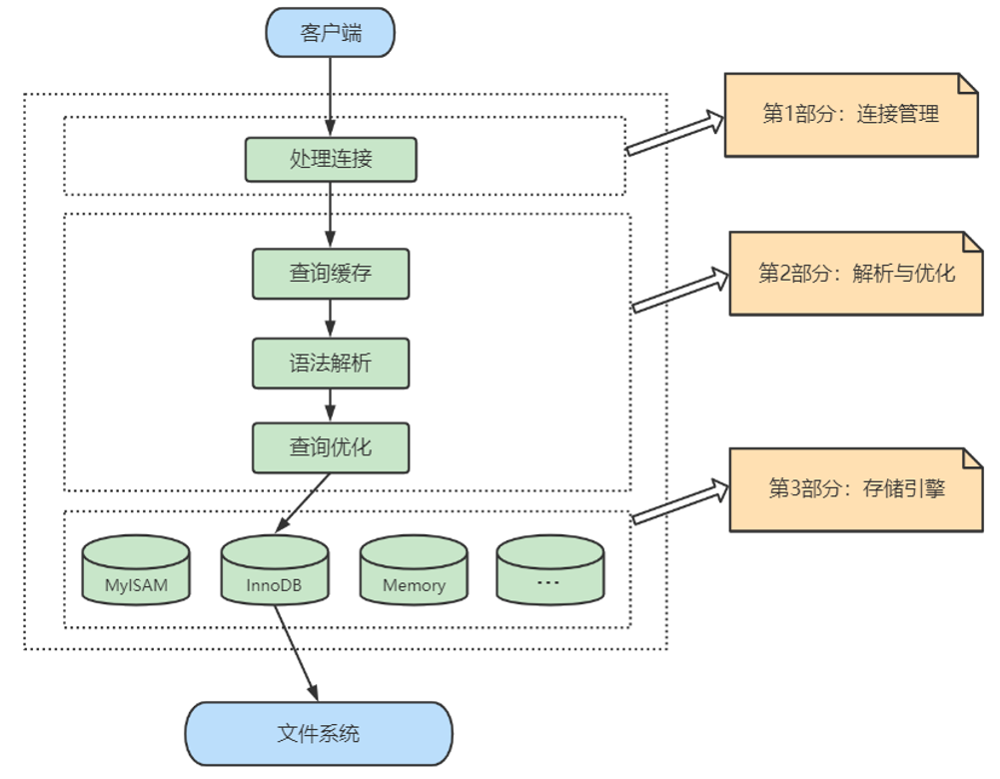  

下面具体展开看一下：  

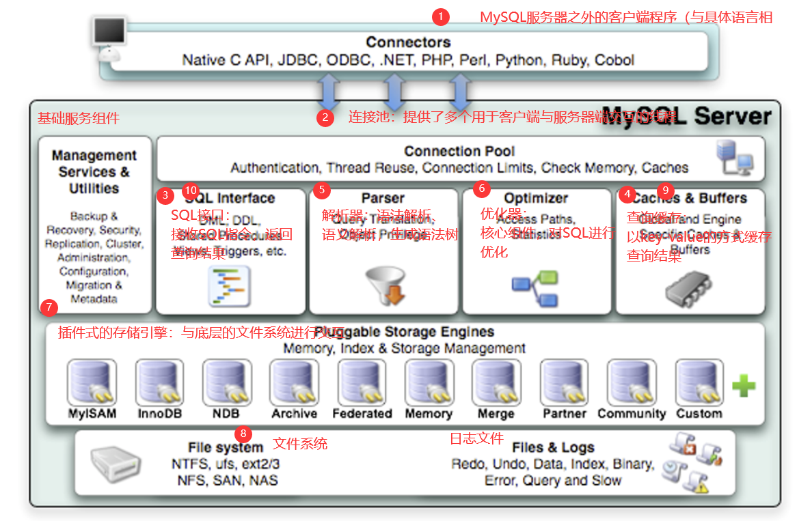  

## 1.2 Connectors  
Connectors，指的是不同语言中与 sql 的交互。MySQL 首先是一个 **网络程序**，在 tcp 之上定义了自己的应用层协议。所以要使用 MysQL，我们可以编写代码，跟 MySQL Server 建立 tcp 连接，之后按照其定义好的协议进行交互。或者比较方便的办法是调用 SDK，比如 Native C API、JDBC、PHP 等各语言 MysQL Connector，或者通过 ODBC。但通过 SDK 来访问 MySQL，本质上还是在 tcp 连接上通过 MySQL 协议跟 MySQL 进行交互。  

## 1.3 第 1 层：连接层  
系统（客户端）访问 MySQL 服务器前，做的第一件事就是建立 TCP 连接。  

经过三次握手建立连接成功后， MySQL 服务器对 TCP 传输过来的账号密码做身份认证、权限获取。  

* 用户名或密码不对，会收到一个 Access denied for user 错误，客户端程序结束执行  
* 用户名密码认证通过，会从权限表查出账号拥有的权限与连接关联，之后的权限判断逻辑，都将依赖于此时读到的权限  

接着我们来思考一个问题：  
一个系统只会和 MySQL 服务器建立一个连接吗？只能有一个系统和 MySQL 服务器建立连接吗？  

当然不是，多个系统都可以和 MySQL 服务器建立连接，每个系统建立的连接肯定不止一个。所以，为了解决 TCP 无限创建与 TCP 频繁创建销毁带来的资源耗尽、性能下降问题。MySQL 服务器里有专门的 **TCP 连接池** 限制连接数，**采用长连接模式复用 TCP 连接**，来解决上述问题。  

TCP 连接收到请求后，必须要分配给一个线程专门与这个客户端的交互。所以还会有个线程池，去走后面的流程。每一个连接从线程池中获取线程，省去了创建和销毁线程的开销。  

这些内容我们都归纳到 MySQL 的连接管理组件中。  

所以连接管理的职责是 **负责认证、管理连接、获取权限信息**。  

## 1.4 第 2 层：服务层  
第二层架构主要完成大多数的核心服务功能，如 SQL 接口，并完成缓存的查询，SQL 的分析和优化及部分内置函数的执行。所有跨存储引擎的功能也在这一层实现，如过程、函数等。  

在该层，服务器会解析查询并创建相应的内部解析树，并对其完成相应的优化：如确定查询表的顺序，是否利用索引等，最后生成相应的执行操作。  

如果是 select 语句，服务器还会查询内部的缓存。如果缓存空间足够大，这样在解决大量读操作的环境中能够很好的提升系统的性能。  

SQL Interface：SQL 接口  
* 接收用户的 SQL 命令，并且返回用户需要查询的结果。比如 select ... from 就是调用 SQL Interface  
  

* MySQL 支持 DML（数据操作语言）、DDL（数据定义语言）、存储过程、视图、触发器、自定义函数等多种 SQL 语言接口

Parser：解析器    
* 在解析器中对 SQL 语句进行语法分析、语义分析。将 SQL 语句分解成数据结构，并将这个结构传递到后续步骤，以后 SQL 语句的传递和处理就是基于这个结构的。如果在分解构成中遇到错误，那么就说明这个 SQL 语句是不合理的。  

* 在 SQL 命令传递到解析器的时候会被解析器验证和解析，并为其创建 **语法树**，并根据 **数据字典** 丰富查询语法树，会 **验证该客户端是否具有执行该查询的权限**。创建好语法树后，MySQL 还会对 SQL 查询进行语法上的优化，进行查询重写。  

Optimizer：查询优化器  
* SQL 语句在语法解析之后、查询之前会使用查询优化器确定 SQL 语句的执行路径，生成一个 **执行计划**。  

* 这个执行计划表明应该 **使用哪些索引** 进行查询（全表检索还是使用索引检索），表之间的连接顺序如何，最后会按照执行计划中的步骤调用存储引擎提供的方法来真正的执行查询，并将查询结果返回给用户。  

* 它使用 **选取-投影-连接** 策略进行查询。例如：
>select id, name from student where gender = '女';  

这个 select 查询先根据 where 语句进行选取，而不是将表全部查询出来以后再进行 gender 过滤。 这个 select 查询先根据 id 和 name 进行属性投影，而不是将属性全部取出以后再进行过滤，将这两个查询条件连接起来生成最终查询结果。  

Caches & Buffers：查询缓存组件  
* MySQL 内部维持着一些 Cache 和 Buffer，比如 Query Cache 用来缓存一条 select 语句的执行结果，如果能够在其中找到对应的查询结果，那么就不必再进行查询解析、优化和执行的整个过程了，直接将结果反馈给客户端。  

* 这个缓存机制是由一系列小缓存组成的。比如表缓存，记录缓存，key 缓存，权限缓存等。   
  

* 这个查询缓存可以在 不同客户端之间共享 。  

* 从 MySQL 5.7.20 开始，不推荐使用查询缓存，并在 MySQL 8.0 中删除。  

## 1.5 第 3 层：引擎层  
和其它数据库相比，MysQL 有点与众不同，它的架构可以在多种不同场景中应用并发挥良好作用，主要体现在存储引擎的架构上，**插件式的存储引擎架构** 将查询处理和其它的系统任务以及数据的存储提取相分离。这种架构可以根据业务的需求和实际需要选择合适的存储引擎。同时开源的 MySQL 还允许 **开发人员设置自己的存储引擎**。  

这种高效的模块化架构为那些希望专门针对特定应用程序需求（例如数据仓库、事务处理或高可用性情况）的人提供了巨大的好处，同时享受使用一组独立于任何接口和服务的优势存储引擎。  

插件式存储引擎层（Storage Engines），**真正的负责了 MySQL 中数据的存储和提取，对物理服务器级别维护的底层数据执行操作**，服务器通过 API 与存储引擎进行通信。不同的存储引擎具有的功能不同，这样我们可以根据自己的实际需要进行选取。  

MySQL 8.0.25 默认支持的存储引擎如下：  

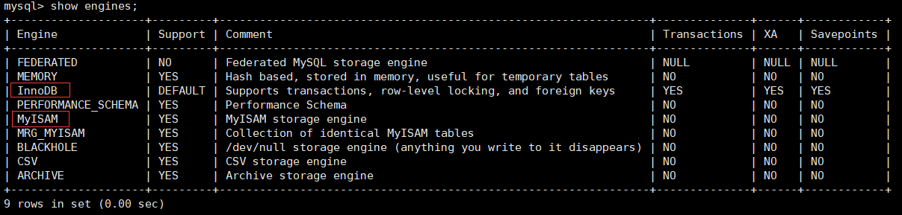  

## 1.6 存储层
所有的数据，数据库、表的定义，表的每一行的内容，索引，都是存在 **文件系统** 上，以 **文件** 的方式存在的，并完成与存储引擎的交互。当然有些存储引擎比如 InnoDB，也支持不使用文件系统直接管理裸设备，但现代文件系统的实现使得这样做没有必要了。在文件系统之下，可以使用本地磁盘，可以使用 DAS、NAS、SAN 等各种存储系统。  

## 1.7 小结
MySQL 架构图本节开篇所示。下面为了熟悉 SQL 执行流程方便，我们可以简化如下：  

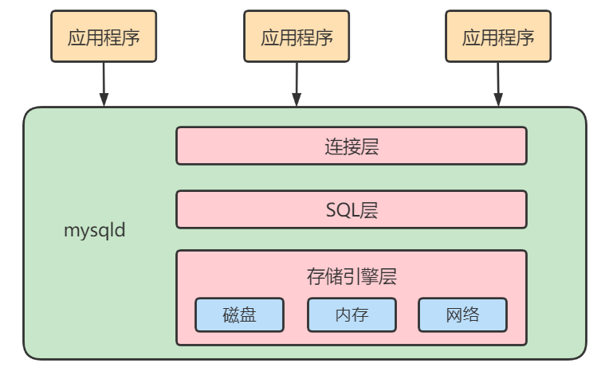  

简化为三层结构：  

（1）连接层：客户端和服务器端建立连接，客户端发送 SQL 至服务器端；  
（2）SQL 层（服务层）：对 SQL 语句进行查询处理；与数据库文件的存储方式无关；  
（3）存储引擎层：与数据库文件打交道，负责数据的存储和读取。  

# 2. SQL 执行流程  
## 2.1 MySQL 中的 SQL 执行流程  

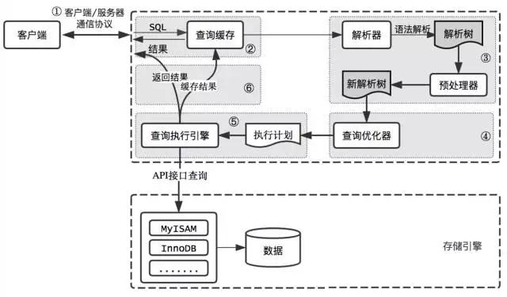  

**MySQL 的查询流程：**  

（1）查询缓存：   
Server 如果在查询缓存中发现了这条 SQL 语句，就会直接将结果返回给客户端；如果没有，就进入到解析器阶段。需要说明的是，因为查询缓存往往效率不高，所以在 MySQL8.0 之后就抛弃了这个功能。  

  

MySQL 拿到一个查询请求后，会先到查询缓存看看，之前是不是执行过这条语句。**之前执行过的语句及其结果可能会以 key-value 对的形式，被直接缓存在内存中**。key 是查询的语句，value 是查询的结果。如果你的查询能够直接在这个缓存中找到 key，那么这个 value 就会被直接返回给客户端。如果语句不在查询缓存中，就会继续后面的执行阶段。**执行完成后，执行结果会被存入查询缓存中**。所以，如果查询命中缓存，MySQL 不需要执行后面的复杂操作，就可以直接返回结果，这个效率会很高。  

大多数情况查询缓存就是个鸡肋，为什么呢？  

查询缓存是提前把查询结果缓存起来，这样下次不需要执行就可以直接拿到结果。需要说明的是，在 MySQL 中的查询缓存，不是缓存查询计划，而是查询对应的结果。这就意味着查询匹配的 **容错性** 大大降低，只有相同的查询操作才会命中查询缓存 。两个查询请求在任何字符上的不同（例如：空格、注释、大小写），都会导致缓存不会命中。因此 MySQL 的查询缓存命中率不高。  

（2）解析器：    
在解析器中对 SQL 语句进行语法分析、语义分析。  

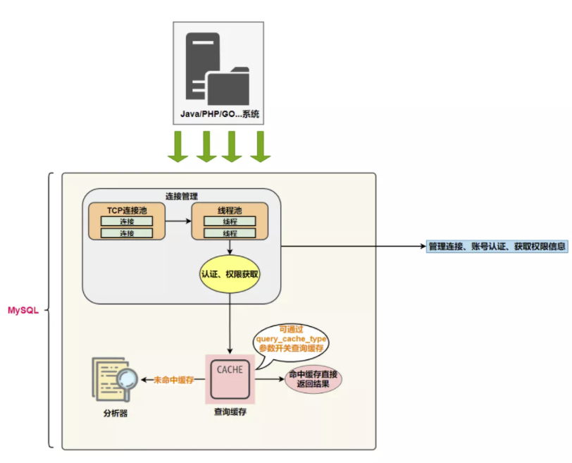  

如果没有命中查询缓存，就要开始真正执行语句了。首先，MySQL 需要知道你要做什么，因此需要对 SQL 语句做解析。SQL 语句的分析分为：**词法分析** 与 **语法分析**。  

分析器先做 **词法分析**。你输入的是由多个字符串和空格组成的一条 SQL 语句，MySQL 需要识别出里面的字符串分别是什么，代表什么。  

MySQL 从你输入的 select 这个关键字识别出来，这是一个查询语句。它也要把字符串 **T** 识别成 **表名 T**，把字符串 **ID** 识别成 **列 ID**。  

接着，要做 **语法分析**。根据词法分析的结果，语法分析器（比如：Bison）会根据语法规则，判断你输入的这个 SQL 语句是否满足 MySQL 语法。  

如果你的语句不对，就会收到 "You have an error in your SQL syntax" 的错误提醒，比如下面这个语句 from 写成了 "fro"。  

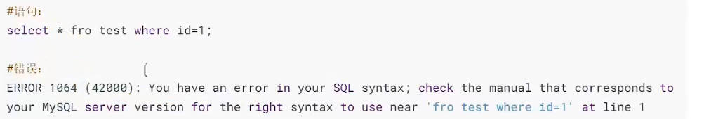  

如果 SQL 语句正确，则会生成一个这样的语法树：  

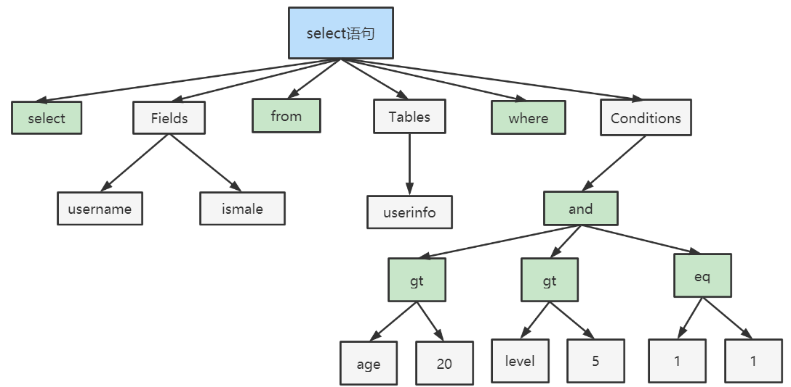  

下图是 SQL 词法分析的过程步骤：  

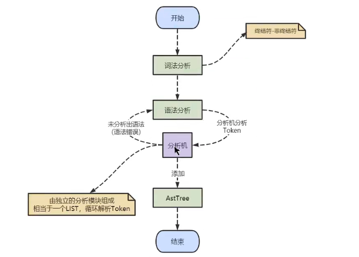  

至此，解析器的工作任务也基本圆满了，接下来进入到优化器。  

（3）优化器：  
在优化器中会确定 SQL 语句的执行路径，比如是根据 **全表检索**，还是根据 **索引检索** 等。  

经过了解析器，MySQL 就知道你要做什么了。在开始执行之前，还要先经过优化器的处理。一条查询可以有很多种执行方式，最后都返回相同的结果。**优化器的作用就是找到这其中最好的执行计划**。  

比如：优化器是在表里面有多个索引的时候，决定使用哪个索引；或者在一个语句有多表关联（join）的时候，决定各个表的连接顺序，还有表达式简化、子查询转为连接、外连接转为内连接等。  

举例：如下语句是执行两个表的 join：  
>select * from test1 join test2 using(ID) where test1.name='zhangwei' and test2.name='mysql高级课程';  
>
>方案 1：可以先从表 test1 里面取出 name='zhangwei' 的记录的 ID 值，再根据 ID 值关联到表 test2，再判断 test2 里面 name的值是否等于 'mysql高级课程'。  
> 
>方案 2：可以先从表 test2 里面取出 name='mysql高级课程' 的记录的 ID 值，再根据 ID 值关联到 test1，再判断 test1 里面 name的值是否等于 zhangwei。  
> 
>这两种执行方法的逻辑结果是一样的，但是执行的效率会有不同，而优化器的作用就是决定选择使用哪一个方案。优化器阶段完成后，这个语句的执行方案就确定下来了，然后进入执行器阶段。  
> 
>如果你还有一些疑问，比如优化器是怎么选择索引的，有没有可能选择错等。后面讲到索引我们再谈。  

在查询优化器中，可以分为 **逻辑查询** 优化阶段和 **物理查询** 优化阶段。  

逻辑查询优化就是通过 **改变 SQL 语句的内容** 来使得 SQL 查询更高效，同时为物理查询优化 **提供更多的候选执行计划**。**通常采用的方式是对 SQL 语句进行等价变换，对查询进行重写**，而查询重写的数学基础就是 **关系代数**。对条件表达式进行等价谓词重写、条件简化，对视图进行重写，对子查询进行优化，对连接语义进行了外连接消除、嵌套连接消除等。  

物理查询优化是 **基于关系代数进行的查询重写**，而关系代数的每一步都对应着物理计算，这些物理计算往往存在多种算法，**因此需要计算各种物理路径的代价，从中选择代价最小的作为执行计划**。在这个阶段里，对于单表和多表连接的操作，需要高效地使用索引，提升查询效率。  

（4）执行器：  
截止到现在，还没有真正去读写真实的表，仅仅只是产出了一个执行计划。于是就进入了 **执行器阶段**。  

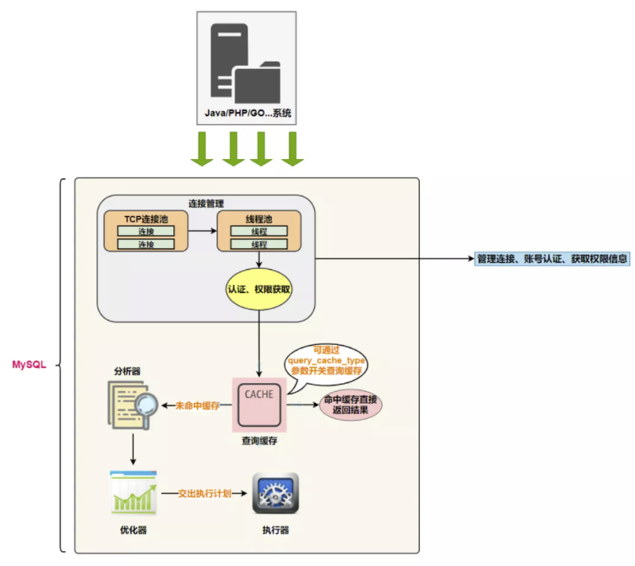  

在执行之前需要判断该用户是否具备权限。如果没有，就会返回权限错误。如果具备权限，就执行 SQL 查询并返回结果。在 MySQL 8.0 以下的版本，如果设置了查询缓存，这时会将查询结果进行缓存。  

如果有权限，就打开表继续执行。打开表的时候，执行器就会根据表的引擎定义，调用存储引擎 API 对表进行的读写。存储引擎 API 只是抽象接口，下面还有个存储引擎层，具体实现还是要看表选择的存储引擎。  

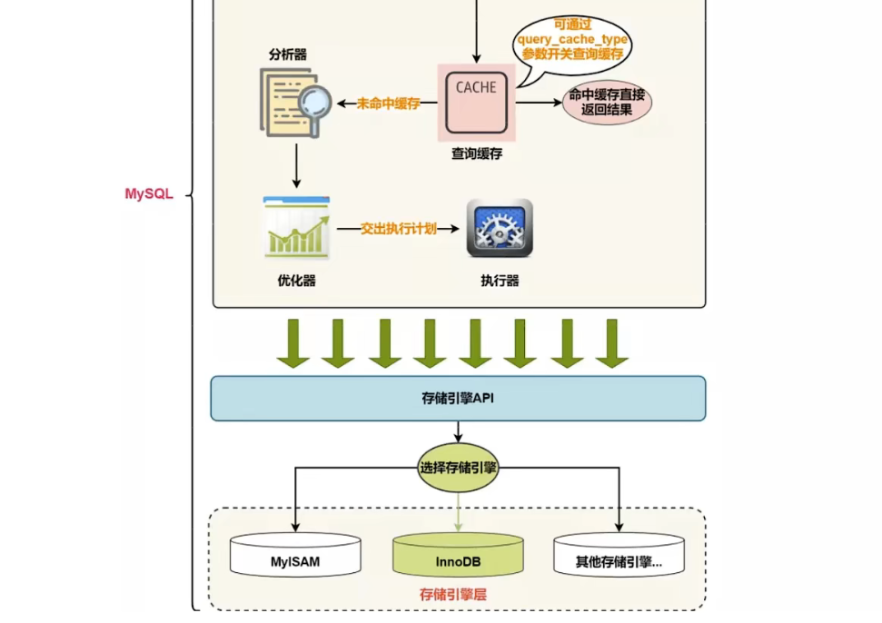  

>select * from test where id=1;  

比如：表 test 中，ID 字段没有索引，那么执行器的执行流程是这样的：

>调用 InnoDB 引擎接口取这个表的第一行，判断 ID 值是不是 1，如果不是则跳过，如果是则将这行存在结果集中；调用引擎接口取 “下一行”，重复相同的判断逻辑，直到取到这个表的最后一行。执行器将上述遍历过程中所有满足条件的行组成的记录集作为结果集返回给客户端。  

至此，这个语句就执行完成了。对于有索引的表，执行的逻辑也差不多。  

SQL 语句在 MySQL 中的流程是：SQL 语句 → 查询缓存 → 解析器 → 优化器 → 执行器。  

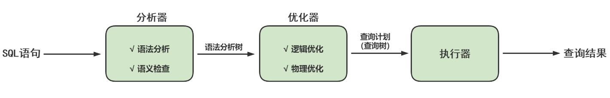  

